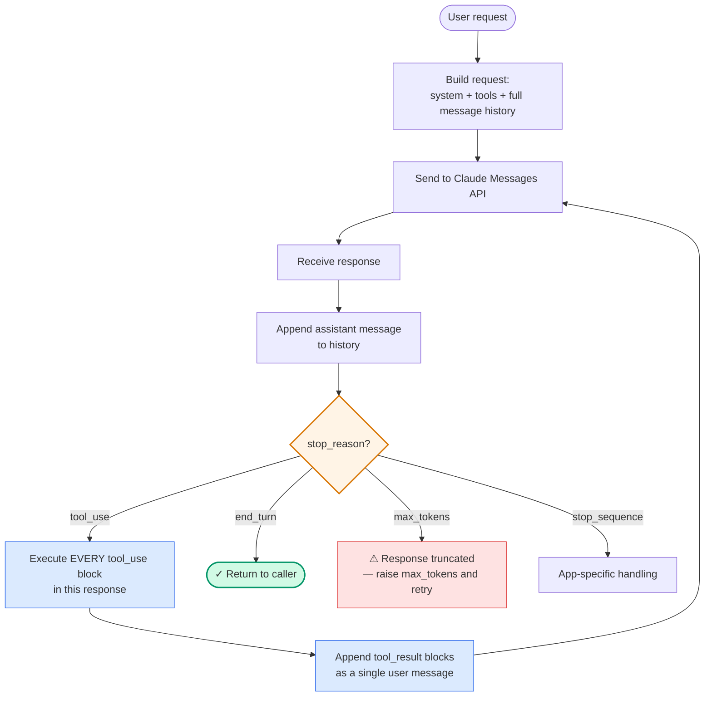

# Diagram 1 — The Agentic Loop

**Domain 1 · Task Statement 1.1 · Weight: 27%**

The agentic loop is the foundational control pattern. Everything else in Domain 1 assumes you understand this. The loop is **model-driven**: Claude decides what tool to call next based on the accumulated context — you don't pre-configure the sequence.

---

## The loop



---

## What to notice

1. **`end_turn` is the only reliable completion signal.** Not the presence of text, not the absence of tool calls, not an iteration count. If you're tempted to reach for any other signal, you're building in a latent bug.

2. **Tool results are *appended*, not replaced.** The full history — every user turn, every assistant turn, every tool call, every tool result — is sent on every subsequent request. The model's next decision depends on this accumulated context.

3. **One response can contain multiple `tool_use` blocks.** Execute all of them, return all results in a single `user` turn with multiple `tool_result` blocks, then loop. This is how parallel tool calls work — there's no separate API for them.

4. **The model picks the tool, not your code.** The whole point of the agentic pattern is model-driven decision making. Pre-routing by keyword or classifier circumvents the reasoning you're paying for.

---

## Anti-patterns the exam tests

Each of these **can** accidentally work some of the time — which is exactly why they're dangerous. The distractor answers in exam questions will often suggest one of these, phrased to sound prudent.

**❌ Text parsing as completion signal**
```python
if "task complete" in response_text.lower():
    break
# The model may use those words mid-task, or never use them at all.
```

**❌ Iteration cap as primary stop**
```python
for _ in range(5):
    response = client.messages.create(...)
    # what if a genuine task needs 6 iterations?
    # what if the model is stuck in a loop at iteration 2?
```
Iteration caps are fine as a **safety net** — they are not the mechanism for normal termination.

**❌ Absence of tool calls = done**
```python
if not any(block.type == "tool_use" for block in response.content):
    return response
# Claude may produce a pure-text turn mid-investigation
# (e.g., restating the plan, asking a clarifying question).
```

**❌ Hard-coded tool sequences**
```python
customer = call_tool("get_customer", ...)
order = call_tool("lookup_order", ...)
refund = call_tool("process_refund", ...)
# This isn't an agentic loop — it's a fixed pipeline.
# If the task needs a different sequence, the system can't adapt.
```

The only stable loop-control signal is `stop_reason == "end_turn"`. Everything else is a leak.

---

## Working example

```python
"""
Minimal agentic loop over the Claude Messages API.
Demonstrates correct stop_reason handling, tool execution,
and history accumulation.
"""
import anthropic

client = anthropic.Anthropic()


def run_agent(
    user_message: str,
    tools: list,
    tool_handlers: dict,
    system: str,
    model: str = "claude-sonnet-4-6",
    max_tokens: int = 4096,
):
    messages = [{"role": "user", "content": user_message}]

    while True:
        response = client.messages.create(
            model=model,
            max_tokens=max_tokens,
            system=system,
            tools=tools,
            messages=messages,
        )

        # 1. ALWAYS append the assistant turn to history before acting on it.
        #    The next request must include this turn for coherent reasoning.
        messages.append({"role": "assistant", "content": response.content})

        # 2. Dispatch on stop_reason — the ONLY reliable loop control.
        if response.stop_reason == "end_turn":
            return response.content

        if response.stop_reason == "max_tokens":
            raise RuntimeError(
                "Response truncated. Increase max_tokens or decompose the task."
            )

        if response.stop_reason == "tool_use":
            # 3. Execute EVERY tool_use block in this response — a single
            #    response can contain multiple tool calls (parallel execution).
            tool_results = []
            for block in response.content:
                if block.type != "tool_use":
                    continue
                try:
                    output = tool_handlers[block.name](**block.input)
                    tool_results.append({
                        "type": "tool_result",
                        "tool_use_id": block.id,
                        "content": str(output),
                    })
                except Exception as e:
                    # Tool-level errors become tool_results with is_error=True,
                    # NOT exceptions that unwind the loop.
                    tool_results.append({
                        "type": "tool_result",
                        "tool_use_id": block.id,
                        "content": f"Error: {e}",
                        "is_error": True,
                    })

            # 4. All tool_results go into a SINGLE user turn, then we loop.
            messages.append({"role": "user", "content": tool_results})
            continue

        # stop_sequence or anything unexpected — return what we have.
        return response.content


# ─────────────────────────────────────────────────────────────
# Example usage — a toy customer lookup tool
# ─────────────────────────────────────────────────────────────
tools = [
    {
        "name": "get_customer",
        "description": (
            "Look up a customer by email or numeric customer_id. "
            "Use this BEFORE any order operations to verify identity. "
            "Returns customer profile including name, email, customer_id, "
            "and account status. Accepts email (user@domain.com) or "
            "integer customer_id."
        ),
        "input_schema": {
            "type": "object",
            "properties": {
                "email": {"type": "string", "description": "Customer email"},
                "customer_id": {"type": "integer", "description": "Numeric customer ID"},
            },
        },
    },
]


def get_customer(email=None, customer_id=None):
    # In reality: call your customer service backend.
    return {
        "customer_id": "CUST-123",
        "name": "Alice Example",
        "email": email or "alice@example.com",
        "status": "active",
    }


handlers = {"get_customer": get_customer}

result = run_agent(
    user_message="Can you look up alice@example.com for me?",
    tools=tools,
    tool_handlers=handlers,
    system="You are a customer support assistant. Use tools to answer questions.",
)
print(result)
```

**Key things to read in this code:**
- The `while True` — there is no iteration cap in the core loop. Add one as an outer safety net if you want, but it is **not** the termination mechanism.
- The assistant message is appended **before** the `stop_reason` dispatch. If you forget this, the next API call will be missing the tool_use block and will fail.
- Tool errors become `tool_result` blocks with `is_error: true`, not Python exceptions that unwind the loop. This lets the model reason about and recover from failures.

---

## How this pattern shows up in exam questions

- **"The agent calls `lookup_order` without calling `get_customer` first."** The loop itself is working correctly — the model just chose that sequence. Fix is a `PreToolUse` hook (Domain 1.5) or tighter tool descriptions (Domain 2.1), not loop surgery.
- **"How do I guarantee a specific tool is called first?"** `tool_choice: {"type": "tool", "name": "..."}` on the first request (Domain 2.3). The loop behaviour is unchanged.
- **"The agent hangs forever."** Almost always: your code is parsing text for completion instead of checking `stop_reason`, or an iteration cap is masking a loop bug.
- **"Agent gets into a loop calling the same tool repeatedly."** The fix is usually upstream — tool description, missing context in the result, or missing normalisation hook — not a cap on repetition.

---

## Related diagrams

- **Diagram 2** — Hub-and-spoke: how this same loop works when the coordinator spawns subagents via `Task`
- **Diagram 6** — Hooks vs prompts: how to intercept this loop deterministically
- **Diagram 7** — Error taxonomy: what to do when a tool in step 3 fails
- **Diagram 17** — Session management: `--resume` and `fork_session` as ways to persist or branch this loop's state
