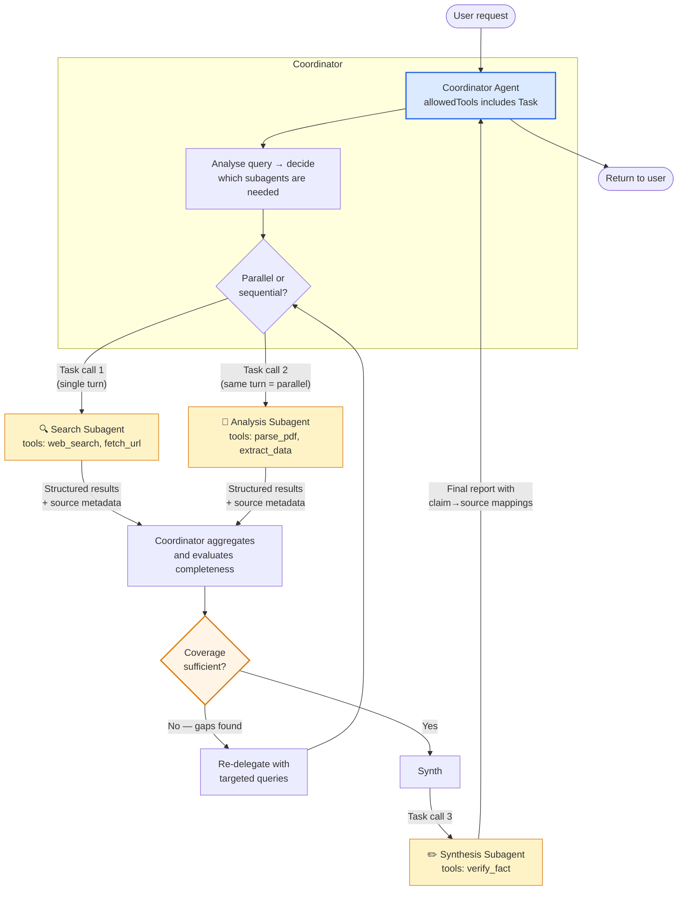

# Diagram 2 — Hub-and-Spoke: Coordinator and Subagents

**Domain 1 · Task Statements 1.2, 1.3 · Weight: 27%**

Multi-agent systems use a hub-and-spoke topology. The coordinator is the only agent that sees the full picture — subagents are specialists with **isolated context** that execute assigned tasks and return results.

---

## The architecture



---

## What to notice

1. **Subagents have isolated context.** They do **not** automatically inherit the coordinator's conversation history, tool results, or system prompt. Every piece of information a subagent needs must be passed explicitly in its `Task` prompt.

2. **Multiple `Task` calls in one coordinator turn = parallel execution.** The coordinator emits Task 1 and Task 2 in a single response — the SDK runs them concurrently. Sequential dispatch uses separate turns.

3. **The coordinator is dynamic, not a fixed pipeline.** It analyses the query and decides which subagents to invoke. A simple question might skip analysis and go straight to synthesis. A broad research question invokes all agents.

4. **All communication routes through the coordinator.** Subagents never talk to each other directly. This gives you one place for observability, error handling, and information-flow control.

5. **Iterative refinement.** After the first pass, the coordinator evaluates coverage. If gaps exist, it re-delegates with targeted queries — not just re-runs the same task.

---

## Anti-patterns the exam tests

**❌ Overly narrow task decomposition**
```
Topic: "AI impact on creative industries"
Coordinator decomposes into:
  → "AI in digital art"
  → "AI in graphic design"
  → "AI in photography"
# Misses music, writing, film entirely.
```
This is exam Question 7 verbatim. The subagents execute perfectly — the problem is what they were assigned.

**❌ Subagent-to-subagent direct communication**
```
search_agent.send_results_to(synthesis_agent)
# Bypasses the coordinator — loses observability,
# error handling, and context control.
```

**❌ Always running the full pipeline**
```
# Every query, no matter how simple, goes through:
search → analysis → synthesis → report
# A simple factual question doesn't need four agents.
```
The coordinator should dynamically select which subagents to invoke based on query complexity.

**❌ Giving subagents too many tools**
```python
# Synthesis agent gets: web_search, fetch_url, parse_pdf, verify_fact, summarize, ...
# 18 tools → selection reliability degrades significantly.
# The synthesis agent starts doing ad-hoc web searches instead of synthesizing.
```
Scope tools to each agent's role. 4–5 tools per agent is the sweet spot.

---

## Working example

```python
"""
Coordinator that spawns parallel search subagents
then delegates synthesis.
"""
import anthropic

client = anthropic.Anthropic()

# ─── Agent definitions ───────────────────────────────────

coordinator = {
    "model": "claude-sonnet-4-6",
    "system": """You are a research coordinator. Your job:
1. Analyse the research question
2. Decompose into subtopics — ensure FULL coverage of the domain
3. Delegate to subagents using the Task tool
4. Evaluate results for gaps — re-delegate if needed
5. Delegate final synthesis

IMPORTANT:
- Each Task prompt must include ALL context the subagent needs
- Subagents cannot see your conversation history
- Emit multiple Task calls in one response for parallel execution
- Specify research goals and quality criteria, not step-by-step procedures""",
    "tools": [
        {
            "name": "Task",
            "description": (
                "Spawn a subagent to perform a research task. "
                "The prompt MUST include all context the subagent needs — "
                "subagents have no access to prior conversation history."
            ),
            "input_schema": {
                "type": "object",
                "properties": {
                    "agent_type": {
                        "type": "string",
                        "enum": ["search", "analysis", "synthesis"],
                        "description": "Which specialist to invoke",
                    },
                    "prompt": {
                        "type": "string",
                        "description": "Complete instructions + context for the subagent",
                    },
                },
                "required": ["agent_type", "prompt"],
            },
        }
    ],
}


# ─── Subagent configurations ─────────────────────────────

SUBAGENT_CONFIGS = {
    "search": {
        "system": """You are a web research specialist.
Search for information on the assigned topic.
Return structured results:
- Each finding must include: claim, evidence, source_url, publication_date
- Separate facts from opinions
- Note any conflicting information with both values preserved""",
        "tools": [
            {
                "name": "web_search",
                "description": "Search the web. Returns top results with snippets.",
                "input_schema": {
                    "type": "object",
                    "properties": {
                        "query": {"type": "string"},
                    },
                    "required": ["query"],
                },
            },
        ],
    },
    "synthesis": {
        "system": """You are a research synthesist.
Combine findings into a coherent report.
Rules:
- Preserve ALL source attributions (claim → source mappings)
- When sources conflict, include both values with attribution — do not pick one
- Structure: well-established findings first, then contested/partial findings
- Annotate coverage gaps explicitly""",
        "tools": [
            {
                "name": "verify_fact",
                "description": (
                    "Quick fact check for dates, names, and statistics. "
                    "Use for simple verifications only — route complex "
                    "research needs back to the coordinator."
                ),
                "input_schema": {
                    "type": "object",
                    "properties": {
                        "claim": {"type": "string"},
                    },
                    "required": ["claim"],
                },
            },
        ],
    },
}


# ─── Execution ────────────────────────────────────────────

def run_subagent(agent_type: str, prompt: str) -> str:
    """Spawn a subagent with its own isolated context."""
    config = SUBAGENT_CONFIGS[agent_type]
    response = client.messages.create(
        model="claude-sonnet-4-6",
        max_tokens=4096,
        system=config["system"],
        tools=config.get("tools", []),
        messages=[{"role": "user", "content": prompt}],
    )
    # In production: run the full agentic loop (Diagram 1)
    # for multi-turn tool use within the subagent.
    return "".join(
        block.text for block in response.content if hasattr(block, "text")
    )


def handle_task_tool(agent_type: str, prompt: str) -> str:
    """Execute a Task tool call by running the appropriate subagent."""
    return run_subagent(agent_type, prompt)


# ─── Context passing example ─────────────────────────────

# BAD: no context — the subagent can't do its job
bad_prompt = "Synthesize the research findings."

# GOOD: complete context passed explicitly
good_prompt = """Synthesize these research findings into a report.

## Search Results (from web search agent)
1. Claim: "AI music market valued at $3.2B"
   Source: Global AI Music Report 2024
   URL: https://example.com/report
   Date: 2024-06-15

2. Claim: "12% of streaming content is AI-generated"
   Source: Spotify Annual Report
   URL: https://example.com/spotify
   Date: 2024-03-01

## Document Analysis Results
1. Claim: "8% of streaming content is AI-generated"
   Source: Music Industry Association Survey
   URL: https://example.com/survey
   Date: 2024-07-15
   Note: CONFLICTS with Search Result #2 — different methodology

## Requirements
- Preserve all source attributions
- Explicitly annotate the 12% vs 8% conflict
- Structure: established findings → contested findings → gaps
"""
```

**Key things to read in this code:**
- The coordinator's system prompt says "specify goals and quality criteria, not step-by-step procedures" — this enables subagent adaptability.
- The `Task` tool schema includes `agent_type` to route to the right specialist configuration.
- The `good_prompt` example shows complete context passing with structured metadata — this is what the exam means by "explicit context passing."
- The synthesis subagent gets a scoped `verify_fact` tool (for 85% of simple fact-checks) instead of full web search tools.

---

## Common exam patterns

- **"Reports cover only visual arts, missing music/film/writing."** → Coordinator decomposed too narrowly (not a subagent problem).
- **"Synthesis agent does ad-hoc web searches."** → It has `fetch_url` when it should only have `verify_fact` — replace with a scoped tool.
- **"Duplicate research across agents."** → Coordinator should partition the research space before delegating, assigning distinct subtopics.
- **"2–3 extra round trips for fact verification."** → Give synthesis a scoped `verify_fact` tool; route complex verification through coordinator.

---

## Related diagrams

- **Diagram 1** — The agentic loop that runs inside each agent
- **Diagram 6** — Hooks: how to intercept tool calls at the coordinator or subagent level
- **Diagram 7** — Error taxonomy: how subagent failures propagate back to the coordinator
- **Diagram 15** — Provenance: how claim→source mappings survive the coordinator→synthesis handoff
