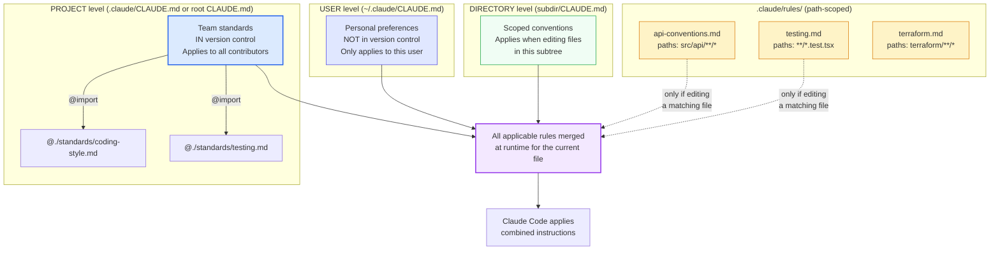

# Diagram 3 — CLAUDE.md Configuration Hierarchy

**Domain 3 · Task Statement 3.1 · Weight: 20%**

CLAUDE.md files tell Claude Code how to behave in your project. They form a three-level hierarchy that merges at runtime, with an import system and a path-scoped rules directory for modular organisation.

---

## The hierarchy



---

## What to notice

1. **User-level is personal and not shared.** `~/.claude/CLAUDE.md` applies only to one developer. If you put team standards here, new team members won't get them. This is the most common diagnostic question on the exam.

2. **Project-level is the team workhorse.** `.claude/CLAUDE.md` (or a root `CLAUDE.md`) goes into version control. Every contributor gets it automatically on clone/pull.

3. **`@import` keeps things modular.** Instead of one monolithic file, you reference external standards files. Each package can import only the standards relevant to its domain.

4. **`.claude/rules/` with `paths` is conditional.** Rules with YAML frontmatter glob patterns load only when Claude Code edits a file matching the pattern. This saves context and tokens — irrelevant rules don't get loaded.

5. **Rules vs directory CLAUDE.md:** use `.claude/rules/` when conventions apply to files **spread across many directories** (test files, migration files). Use directory CLAUDE.md when conventions are genuinely local to one directory.

---

## File examples

### Project-level CLAUDE.md (`.claude/CLAUDE.md`)

```markdown
# Project Standards

## Code Style
All code follows @./standards/coding-style.md

## Testing
Testing requirements are defined in @./standards/testing.md

## Architecture
- This is a monorepo with three packages: api, web, shared
- API uses Express with TypeScript
- Web uses React with TypeScript
- Shared contains domain types and utilities

## Conventions
- Use named exports, not default exports
- All async functions must have explicit error handling
- Database access goes through the repository pattern in src/repos/
```

### Path-scoped rule (`.claude/rules/testing.md`)

```yaml
---
paths: ["**/*.test.tsx", "**/*.test.ts", "**/*.spec.ts"]
---

# Testing Conventions

- Use `describe`/`it` blocks, not `test()`
- Use data factories from `src/test/factories/` — never hardcode test data
- Do not mock the database — use the test database via `setupTestDb()`
- Each test file must import and use `beforeEach(cleanDb)` for isolation
- Snapshot tests are forbidden for components with dynamic content
```

### Path-scoped rule (`.claude/rules/api-conventions.md`)

```yaml
---
paths: ["src/api/**/*"]
---

# API Conventions

- Every endpoint handler must use the `asyncHandler()` wrapper
- Return `ApiResponse<T>` — never raw objects
- Validate all input with Zod schemas before processing
- Error responses use the standard `ApiError` class
- Rate limiting is configured per-route in `src/api/middleware/rate-limit.ts`
```

### User-level CLAUDE.md (`~/.claude/CLAUDE.md`)

```markdown
# Personal Preferences

- I prefer verbose variable names over abbreviations
- When showing diffs, include 5 lines of surrounding context
- Always explain the "why" when suggesting changes, not just the "what"
```

---

## Anti-patterns the exam tests

**❌ Team standards in user-level config**
```
~/.claude/CLAUDE.md  ← "All code must use async/await..."
# New team member clones the repo and doesn't get these rules.
# Fix: move to .claude/CLAUDE.md (project-level).
```

**❌ Monolithic CLAUDE.md with everything**
```
# 500-line CLAUDE.md covering testing, API, React, Terraform, deployment...
# Every rule is loaded for every file, wasting context tokens.
# Fix: split into .claude/rules/ with path-scoped frontmatter.
```

**❌ Directory CLAUDE.md for cross-cutting concerns**
```
src/components/CLAUDE.md    ← "Tests must use data factories"
src/api/CLAUDE.md           ← "Tests must use data factories"
src/utils/CLAUDE.md         ← "Tests must use data factories"
# Duplicated in every directory because tests are everywhere.
# Fix: .claude/rules/testing.md with paths: ["**/*.test.*"]
```

**❌ Relying on inference instead of explicit matching**
```
# Root CLAUDE.md with sections like "## For API files" / "## For Tests"
# Claude must infer which section applies — unreliable.
# Fix: .claude/rules/ with explicit glob patterns for deterministic matching.
```

---

## The `/memory` command

Use `/memory` to verify which memory files are loaded in the current session and diagnose inconsistent behaviour:

```
> /memory

Loaded memory files:
  ~/.claude/CLAUDE.md (user)
  .claude/CLAUDE.md (project)
  .claude/rules/testing.md (matched: src/api/auth.test.ts)
```

If a rule you expect isn't listed, check the `paths` glob pattern — it may not match the file you're editing.

---

## Common exam patterns

- **"New team member doesn't get project instructions."** → Instructions are in `~/.claude/CLAUDE.md` (user-level); move to `.claude/CLAUDE.md` (project-level).
- **"Different areas of the codebase need different conventions."** → `.claude/rules/` with glob-pattern frontmatter — **not** one big CLAUDE.md with headers.
- **"Test conventions must apply to `*.test.tsx` files spread across the whole repo."** → `.claude/rules/testing.md` with `paths: ["**/*.test.tsx"]` — **not** a CLAUDE.md in every directory.
- **"How to keep CLAUDE.md manageable?"** → `@import` syntax to reference modular standards files, or split into `.claude/rules/` topic files.

---

## Related diagrams

- **Diagram 4** — Path-scoped rules in detail (the glob-matching mechanism)
- **Diagram 5** — MCP server config (similar project-vs-user scoping pattern)
- **Diagram 9** — Plan mode (configured alongside these files but serves a different purpose)
