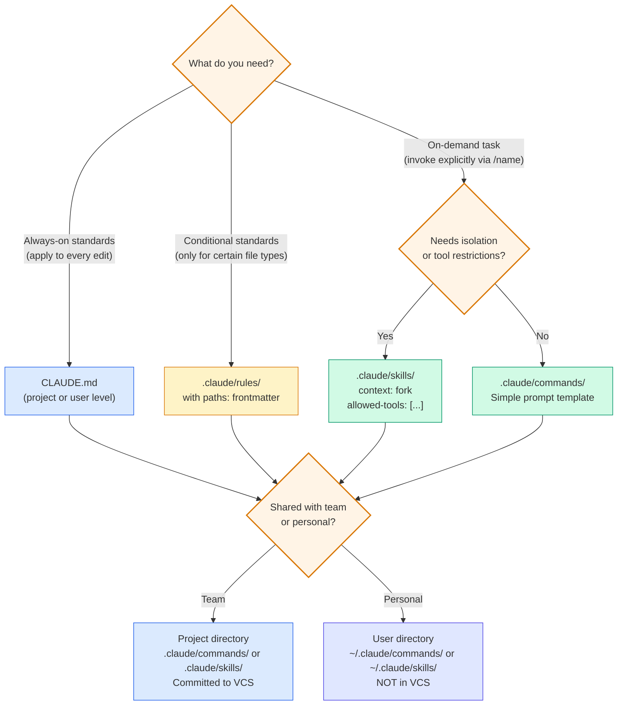
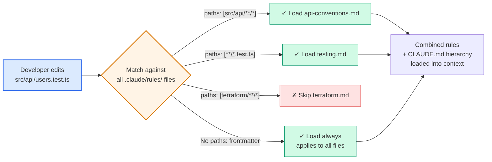

# Diagram 4 — Custom Commands, Skills, and Path-Scoped Rules

**Domain 3 · Task Statements 3.2, 3.3 · Weight: 20%**

Claude Code supports three types of developer-defined configuration beyond CLAUDE.md: slash commands, skills, and path-scoped rules. Each has a different scope, invocation model, and exam-testable set of properties.

---

## Decision flow: which mechanism to use



---

## Path-scoped rules — the glob-matching mechanism



---

## What to notice

1. **Path-scoped rules load only on match.** A rule with `paths: ["terraform/**/*"]` contributes zero tokens when you're editing a React component. This makes rules scalable.

2. **Glob patterns match by file type regardless of directory location.** `**/*.test.tsx` catches test files whether they're in `src/components/`, `src/api/`, or `src/utils/`. This is the key advantage over directory-level CLAUDE.md for cross-cutting concerns.

3. **`context: fork` is for isolation.** A skill with `context: fork` runs in a subagent — its verbose output (codebase analysis, brainstorming) never pollutes the main conversation context. The main session only gets the skill's final output.

4. **`allowed-tools` is for safety.** A skill with `allowed-tools: ["Read", "Grep"]` cannot accidentally delete files or run destructive commands, even if its prompt template is ambiguous.

5. **Commands vs skills:** `.claude/commands/` is the simpler legacy format (just a prompt template in a `.md` file). `.claude/skills/` adds frontmatter configuration (`context`, `allowed-tools`, `argument-hint`). Both create `/name` slash commands.

---

## File examples

### Simple command (`.claude/commands/review.md`)

```markdown
Review the staged changes for:
1. Logic errors and edge cases
2. Security vulnerabilities (injection, auth bypass)
3. Missing error handling
4. Inconsistent naming

Output each finding as:
  File: <path>
  Line: <number>
  Severity: critical | high | medium | low
  Issue: <description>
  Fix: <concrete suggestion>
```

### Skill with isolation and tool restrictions (`.claude/skills/analyze-deps/SKILL.md`)

```yaml
---
context: fork
allowed-tools: ["Read", "Grep", "Glob"]
argument-hint: "path to the module to analyze"
---

Analyze the dependency graph of the specified module.

1. Use Glob to find all source files in the module
2. Use Grep to find all import statements
3. Use Read to inspect complex dependency chains
4. Map: direct dependencies, transitive dependencies, circular references

Output a structured dependency report. Do NOT modify any files.
```

### Skill with argument hint (`.claude/skills/test-gen/SKILL.md`)

```yaml
---
context: fork
allowed-tools: ["Read", "Grep", "Glob", "Write"]
argument-hint: "path to the source file to test"
---

Generate comprehensive tests for the specified file.

Before writing tests:
1. Read the source file and understand its public API
2. Grep for existing tests (*.test.ts, *.spec.ts) to avoid duplication
3. Read existing test files to match the project's testing style

Write tests that cover:
- Happy path for each public function
- Edge cases (null, empty, boundary values)
- Error conditions
- Any integration points (mock external dependencies)

Use the project's test factories from src/test/factories/.
```

---

## Anti-patterns the exam tests

**❌ Using skills when you want deterministic automatic application**
```
# Skills require explicit invocation (/analyze-deps)
# They don't auto-apply when you edit a file.
# For automatic convention application → .claude/rules/ with paths
```

**❌ Personal commands shadowing project commands**
```
~/.claude/skills/review/SKILL.md   ← personal variant
.claude/skills/review/SKILL.md     ← project standard
# Same name creates confusion.
# Fix: name personal variants differently (e.g., /my-review)
```

**❌ Not using `context: fork` for verbose skills**
```
# A skill that reads 50 files to map a codebase dumps all
# that exploration output into the main session context.
# Fix: add context: fork so it runs in isolation.
```

**❌ Project standards in user-scoped commands**
```
~/.claude/commands/review.md   ← not shared via VCS
# Teammates won't have this command.
# Fix: .claude/commands/review.md (project-scoped)
```

---

## Common exam patterns

- **"Where should a team-wide `/review` command live?"** → `.claude/commands/` in the project repo (committed to VCS). **Not** `~/.claude/commands/` (personal, not shared).
- **"Test conventions must apply automatically to all test files."** → `.claude/rules/testing.md` with `paths: ["**/*.test.*"]` — **not** a skill (requires manual invocation).
- **"A codebase analysis skill floods the main session with verbose output."** → Add `context: fork` to the skill frontmatter.
- **"Skills vs CLAUDE.md?"** → Skills are on-demand for specific tasks; CLAUDE.md is always-loaded project standards.

---

## Related diagrams

- **Diagram 3** — CLAUDE.md hierarchy (the always-loaded layer these extend)
- **Diagram 9** — Plan mode vs direct execution (another workflow-level choice)
