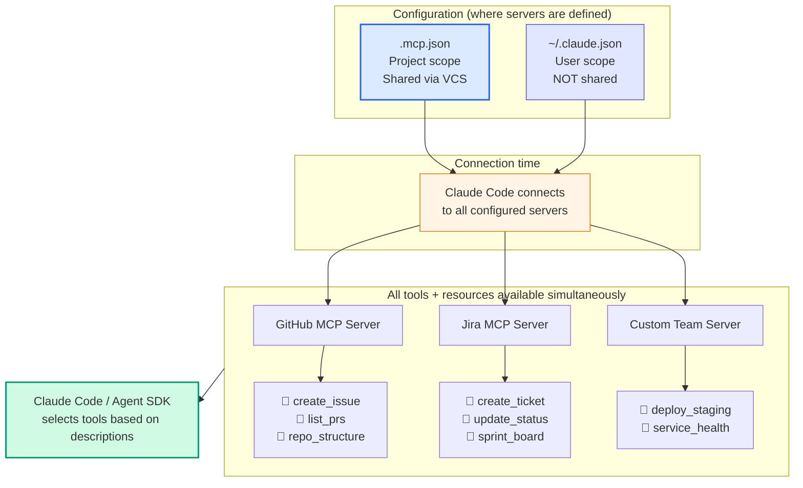
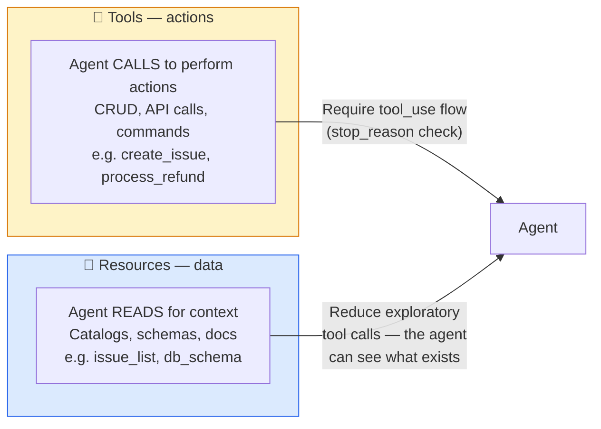

# Diagram 5 — MCP Architecture: Servers, Tools, and Resources

**Domain 2 · Task Statement 2.4 · Weight: 18%**

The Model Context Protocol (MCP) is the standard way to connect external systems to Claude. MCP servers expose **tools** (actions the agent can perform) and **resources** (data the agent can read for context). Server configuration follows the same project-vs-user scoping pattern as CLAUDE.md.

---

## Architecture



---

## Tools vs resources



**Resources are the "map."** Without resources, an agent must make exploratory tool calls to discover what data exists ("list all issues", "show all tables"). Resources expose content catalogs upfront so the agent can navigate directly to what it needs.

---

## What to notice

1. **All servers discovered on connection, tools available simultaneously.** The agent sees tools from every connected MCP server at once. This means tool descriptions must be clear enough to avoid cross-server confusion.

2. **Env var expansion for secrets.** `.mcp.json` uses `${GITHUB_TOKEN}` syntax — the actual token comes from the environment, never committed to VCS.

3. **Prefer community servers for standard integrations.** Don't build a custom Jira MCP server when a maintained community one exists. Reserve custom servers for team-specific workflows.

4. **Tool descriptions drive adoption.** If an MCP tool has a weak description, the agent may prefer a built-in tool (like Grep) over the more capable MCP alternative. Enhance MCP tool descriptions to highlight what they can do that built-in tools cannot.

---

## Configuration examples

### Project config (`.mcp.json` — committed to VCS)

```json
{
  "mcpServers": {
    "github": {
      "command": "npx",
      "args": ["-y", "@modelcontextprotocol/server-github"],
      "env": {
        "GITHUB_TOKEN": "${GITHUB_TOKEN}"
      }
    },
    "jira": {
      "command": "npx",
      "args": ["-y", "mcp-server-jira"],
      "env": {
        "JIRA_URL": "${JIRA_URL}",
        "JIRA_TOKEN": "${JIRA_TOKEN}"
      }
    },
    "internal-api": {
      "command": "node",
      "args": ["./tools/mcp-server/index.js"],
      "env": {
        "API_BASE_URL": "${API_BASE_URL}",
        "API_KEY": "${API_KEY}"
      }
    }
  }
}
```

### User config (`~/.claude.json` — personal, not committed)

```json
{
  "mcpServers": {
    "experimental-rag": {
      "command": "python",
      "args": ["~/projects/rag-server/main.py"],
      "env": {
        "PINECONE_API_KEY": "${PINECONE_API_KEY}"
      }
    }
  }
}
```

### Good vs bad tool descriptions

```json
{
  "name": "search_issues",
  "description": "Searches GitHub issues."
}
```
⬆ **Bad.** Minimal description — the agent may confuse this with Jira's `search_tickets` or even prefer built-in Grep for text search.

```json
{
  "name": "search_github_issues",
  "description": "Search GitHub issues and pull requests in the current repository. Accepts JQL-style filters (label:bug, state:open, assignee:username). Returns issue number, title, labels, assignee, and creation date. Use this instead of Grep when you need metadata about issues (labels, assignees, state) rather than just text content in code files."
}
```
⬆ **Good.** Unique name, clear input format, explicit output shape, and an explicit boundary ("use this instead of Grep when...").

---

## Anti-patterns the exam tests

**❌ Committing secrets in `.mcp.json`**
```json
{
  "env": { "GITHUB_TOKEN": "ghp_abc123realtoken" }
}
```
Always use env var expansion: `"${GITHUB_TOKEN}"`.

**❌ Building a custom server when a community one exists**
```
# You want Jira integration.
# Don't write your own MCP server.
# Use the maintained community mcp-server-jira.
```

**❌ Weak MCP descriptions losing to built-in tools**
```
# MCP tool: "search_docs" — "Searches documentation"
# Built-in: Grep can also search text in files
# Agent picks Grep because descriptions are equally vague.
# Fix: strengthen the MCP description with unique capabilities.
```

**❌ Personal experiments in project config**
```
# .mcp.json contains your experimental RAG server.
# Teammates can't start it; their sessions fail on connection.
# Fix: personal servers go in ~/.claude.json
```

---

## Common exam patterns

- **"Where to configure a shared MCP server?"** → `.mcp.json` in the project root, with `${ENV_VAR}` for secrets.
- **"Where to put a personal experimental server?"** → `~/.claude.json` (user-level).
- **"Agent prefers Grep over a more capable MCP tool."** → Enhance the MCP tool's description to highlight unique capabilities.
- **"How does the agent know what tools exist?"** → All tools from all connected servers are discovered on connection and available simultaneously. Resources provide content catalogs.

---

## Related diagrams

- **Diagram 3** — CLAUDE.md hierarchy (same project-vs-user scoping pattern)
- **Diagram 7** — Error taxonomy (MCP's `isError` flag for structured error responses)
- **Diagram 11** — Tool choice (how `tool_choice` config interacts with MCP tools)
