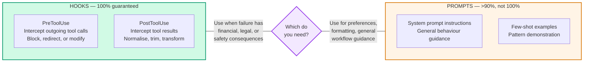
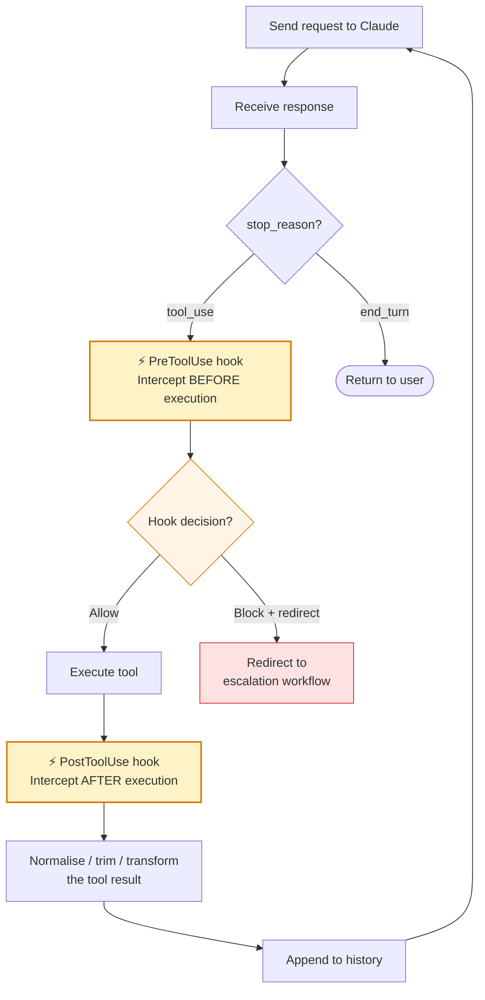

# Diagram 6 — Hooks vs Prompt Enforcement

**Domain 1 · Task Statement 1.5 · Weight: 27%**

Hooks and prompt instructions are two ways to influence agent behaviour. The exam repeatedly tests whether you know **when each is appropriate** — the answer hinges on whether you need a deterministic guarantee or probabilistic guidance.

---

## The spectrum



---

## Hook interception points in the agentic loop



---

## What to notice

1. **PreToolUse fires before execution.** It can inspect the tool name and arguments, then decide to allow, block, or redirect. The tool never runs if the hook blocks it.

2. **PostToolUse fires after execution.** It can transform the result before the model sees it. The model processes the normalised version, not the raw output.

3. **Hooks are code, not prompts.** They run deterministically in your application — they don't depend on the model interpreting an instruction correctly. A hook that blocks refunds over $500 will **always** block them.

4. **Prompt instructions are probabilistic.** "Always call `get_customer` before `lookup_order`" works >90% of the time — but when it fails, you get a misidentified account and an incorrect refund.

---

## Working example: PreToolUse — block refunds above threshold

```python
"""
PreToolUse hook that enforces a refund policy.
If a process_refund call exceeds $500, block it and redirect to escalation.
"""

from claude_agent_sdk import hook


@hook("PreToolUse")
def enforce_refund_limit(tool_call):
    if tool_call.name != "process_refund":
        return tool_call  # Allow all other tools

    amount = tool_call.args.get("amount", 0)
    if amount > 500:
        # Block the call — the model never executes process_refund.
        # Instead, redirect to escalation with context.
        return {
            "redirect": "escalate_to_human",
            "args": {
                "reason": f"Refund amount ${amount} exceeds $500 policy limit",
                "customer_id": tool_call.args.get("customer_id"),
                "original_request": tool_call.args,
            },
        }

    return tool_call  # Amount is within limit — proceed
```

## Working example: PostToolUse — normalise data formats

```python
"""
PostToolUse hook that normalises heterogeneous date formats
from different MCP tools before the model processes them.
"""
from datetime import datetime
from claude_agent_sdk import hook


@hook("PostToolUse")
def normalise_dates(tool_name, tool_result):
    """Convert all date-like fields to ISO 8601 before the model sees them."""
    if not isinstance(tool_result, dict):
        return tool_result

    normalised = {}
    for key, value in tool_result.items():
        if key.endswith("_date") or key.endswith("_at"):
            normalised[key] = _to_iso8601(value)
        else:
            normalised[key] = value
    return normalised


def _to_iso8601(value) -> str:
    """Handle Unix timestamps, US-format dates, and ISO strings."""
    if isinstance(value, (int, float)):
        # Unix timestamp → ISO 8601
        return datetime.utcfromtimestamp(value).isoformat()
    if isinstance(value, str):
        for fmt in ("%m/%d/%Y", "%B %d, %Y", "%b %d, %Y", "%Y-%m-%d"):
            try:
                return datetime.strptime(value, fmt).date().isoformat()
            except ValueError:
                continue
    return str(value)  # Return as-is if we can't parse
```

## Working example: PostToolUse — trim verbose tool output

```python
"""
PostToolUse hook that trims a 40+ field order lookup
down to the 5 fields relevant for refund processing.
Prevents context bloat from accumulated tool results.
"""
from claude_agent_sdk import hook

REFUND_RELEVANT_FIELDS = {
    "order_id", "status", "total", "items", "return_eligible",
}


@hook("PostToolUse", tool="lookup_order")
def trim_order_fields(tool_name, tool_result):
    if not isinstance(tool_result, dict):
        return tool_result
    return {k: v for k, v in tool_result.items() if k in REFUND_RELEVANT_FIELDS}
```

---

## When to use which — decision reference

| Scenario | Mechanism | Why |
|---|---|---|
| Block refunds over $500 | **PreToolUse hook** | Financial consequence — must be 100% |
| Verify customer ID before order lookup | **PreToolUse hook** | Business-critical ordering — can't tolerate 10% failure |
| Normalise date formats from MCP tools | **PostToolUse hook** | Data consistency before model reasoning |
| Trim verbose tool output to relevant fields | **PostToolUse hook** | Context window management |
| "Try to resolve before escalating" | **Prompt instruction** | Soft preference, not a hard requirement |
| "Use formal language in responses" | **Prompt instruction** | Style preference |
| "Prefer Markdown tables for comparisons" | **Prompt instruction** | Output formatting |
| "When uncertain, ask a clarifying question" | **Prompt instruction** | General guidance |

---

## Anti-patterns the exam tests

**❌ Prompt instructions for critical business rules**
```
System prompt: "You MUST call get_customer before process_refund.
This is a mandatory requirement."
# Works ~92% of the time. The other 8% process incorrect refunds.
# Fix: PreToolUse hook that blocks process_refund without a verified customer_id.
```

**❌ Hooks for soft preferences**
```python
@hook("PostToolUse")
def enforce_markdown_tables(tool_name, result):
    # Converting all tool results to Markdown tables...
# Over-engineering. A prompt instruction handles formatting fine.
```

**❌ Not distinguishing guarantee requirements**
The exam distractor pattern: answer A is a hook, answer B is a prompt. They both "work" — but only one matches the **requirement**. If the scenario says "12% of cases skip identity verification leading to incorrect refunds," that's a financial consequence requiring deterministic enforcement.

---

## Common exam patterns

- **"In 12% of cases the agent skips `get_customer`..."** → PreToolUse hook that blocks downstream tools until `get_customer` returns a verified ID. **Not** an improved system prompt. **Not** few-shot examples.
- **"Refunds above $500 must always require human approval."** → PreToolUse hook. The word "always" and the financial context are the clues.
- **"Tool results contain inconsistent date formats."** → PostToolUse hook to normalise before the model processes them.
- **"Tool returns 40+ fields but only 5 are relevant."** → PostToolUse hook to trim — prevents context bloat.

---

## Related diagrams

- **Diagram 1** — The agentic loop (hooks sit inside this loop)
- **Diagram 2** — Hub-and-spoke (hooks can run at coordinator or subagent level)
- **Diagram 7** — Error taxonomy (hooks can catch and restructure errors too)
- **Diagram 14** — Context management (PostToolUse trimming is a context strategy)
