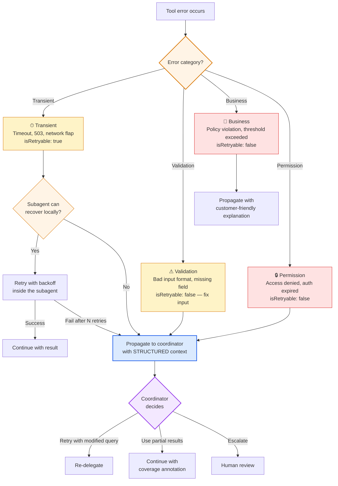
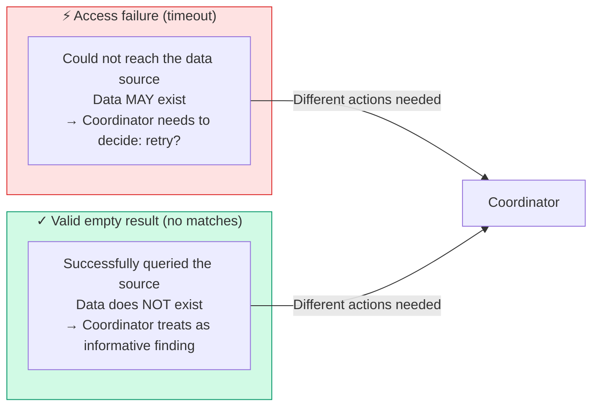

# Diagram 7 — Error Taxonomy and Propagation

**Domain 2 · Task Statement 2.2 / Domain 5 · Task Statement 5.3 · Weight: 18% + 15%**

Errors in multi-agent systems must carry enough structure for the coordinator to make **intelligent recovery decisions**. The exam repeatedly tests whether you can distinguish error categories, propagation patterns, and the anti-patterns that destroy recoverability.

---

## Error categories



---

## The critical distinction: access failure vs empty result



Both can produce "no data" — but they mean entirely different things. A timeout means "we don't know." Zero results means "we looked and there's nothing there." Conflating them causes the coordinator to either waste retries on genuinely empty results or skip retries on transient failures.

---

## What to notice

1. **Handle at the lowest level capable.** Subagents should retry transient errors locally (1–2 attempts with backoff) before propagating. Only escalate what they can't resolve.

2. **Structured error context enables recovery.** The coordinator needs: error category, what was attempted, partial results, and alternative approaches. Without this, it can't make an informed decision.

3. **Business errors need user-facing explanations.** When a policy violation blocks an action, the error should include a customer-friendly message the agent can relay — not just an internal error code.

4. **Coverage annotations in the final output.** If a source was unavailable, the synthesis report should annotate which sections have full coverage vs partial coverage vs gaps.

---

## Working example: structured MCP error response

```python
"""
MCP tool implementation with structured error responses.
Demonstrates how each error category should be reported.
"""


def lookup_order(order_id: str) -> dict:
    """MCP tool: look up an order by ID."""
    try:
        order = orders_api.get(order_id)
        if order is None:
            # Valid empty result — the order genuinely doesn't exist.
            return {
                "isError": False,
                "content": {
                    "result": None,
                    "message": f"No order found with ID {order_id}",
                },
            }
        return {"isError": False, "content": order}

    except TimeoutError:
        # Transient — the API is slow, might work on retry.
        return {
            "isError": True,
            "content": {
                "errorCategory": "transient",
                "isRetryable": True,
                "message": "Orders API timed out after 5s",
                "attemptedQuery": f"order_id={order_id}",
                "partialResults": None,
            },
        }

    except PermissionError:
        # Permission — credentials issue, won't fix on retry.
        return {
            "isError": True,
            "content": {
                "errorCategory": "permission",
                "isRetryable": False,
                "message": "Access denied to Orders API. Check API credentials.",
                "attemptedQuery": f"order_id={order_id}",
            },
        }

    except ValidationError as e:
        # Validation — input was malformed.
        return {
            "isError": True,
            "content": {
                "errorCategory": "validation",
                "isRetryable": False,
                "message": f"Invalid order ID format: {e}",
                "attemptedQuery": f"order_id={order_id}",
                "hint": "Order IDs must be in format ORD-XXXXX",
            },
        }


def process_refund(customer_id: str, order_id: str, amount: float) -> dict:
    """MCP tool: process a refund. Demonstrates business error."""
    if amount > 500:
        # Business rule — this won't change on retry.
        return {
            "isError": True,
            "content": {
                "errorCategory": "business",
                "isRetryable": False,
                "message": (
                    f"Refund of ${amount:.2f} exceeds the $500 automated limit. "
                    "This refund requires manager approval."
                ),
                "customerFriendlyMessage": (
                    "I need to escalate this refund to a manager for approval, "
                    "as it exceeds our automated processing limit."
                ),
                "suggestedAction": "escalate_to_human",
            },
        }
    # ... process the refund
```

## Working example: subagent error propagation

```python
"""
Subagent that handles errors locally when possible,
then propagates structured context to the coordinator.
"""
import time


def web_search_subagent(query: str, max_retries: int = 2) -> dict:
    """Search subagent with local recovery for transient failures."""
    partial_results = []

    for source in ["academic_db", "news_archive", "patent_db"]:
        for attempt in range(max_retries + 1):
            try:
                results = search_source(source, query)
                partial_results.extend(results)
                break  # Success — move to next source

            except TimeoutError:
                if attempt < max_retries:
                    time.sleep(2 ** attempt)  # Exponential backoff
                    continue  # Retry locally
                else:
                    # Exhausted local retries — record the failure
                    # but DON'T abort the whole search.
                    partial_results.append({
                        "source": source,
                        "status": "failed",
                        "failure_type": "timeout",
                        "attempted_query": query,
                        "retries_attempted": max_retries,
                    })

    # Return whatever we got — partial success is still valuable.
    succeeded = [r for r in partial_results if r.get("status") != "failed"]
    failed = [r for r in partial_results if r.get("status") == "failed"]

    return {
        "status": "partial_failure" if failed else "success",
        "results": succeeded,
        "failures": failed,
        "coverage_impact": [
            f"Source '{f['source']}' unavailable — "
            f"topics from this source may be underrepresented"
            for f in failed
        ],
        "alternative_approaches": [
            f"Retry '{f['source']}' with narrower query"
            for f in failed
        ],
    }
```

---

## Anti-patterns the exam tests

**❌ Generic error status**
```python
return {"isError": True, "content": "Operation failed"}
# Coordinator can't decide: retry? reroute? escalate?
```

**❌ Silent suppression (empty result = success)**
```python
except TimeoutError:
    return {"isError": False, "content": {"results": []}}
# Coordinator thinks "no results found" — never retries.
```

**❌ Abort entire workflow on single failure**
```python
except TimeoutError:
    raise  # Kills the whole research pipeline
# Partial results from other sources are lost.
```

**❌ Infinite retries inside a subagent**
```python
while True:
    try: return search(query)
    except TimeoutError: time.sleep(1)
# Wastes time and tokens. Cap local retries at 1–2.
```

---

## Common exam patterns

- **"Web search agent times out — how should error info flow to coordinator?"** → Structured error context (failure type, query, partial results, alternatives). **Not** generic "search unavailable." **Not** silent empty result.
- **"Industry reports return 0 results; patent DB times out."** → Distinguish the two: 0 results is a valid finding; timeout is an access failure needing a retry decision.
- **"How should the subagent handle a corrupted PDF?"** → Return error with context to the coordinator, letting it decide (skip, try another parser, notify user). **Not** silently skip. **Not** abort everything.
- **"Synthesis report should show where data is incomplete."** → Coverage annotations: "FULL COVERAGE" vs "PARTIAL — search agent timeout."

---

## Related diagrams

- **Diagram 1** — The agentic loop (error handling happens inside this loop)
- **Diagram 2** — Hub-and-spoke (errors propagate from subagent to coordinator)
- **Diagram 6** — Hooks (PreToolUse can catch policy violations before they become errors)
- **Diagram 15** — Provenance (coverage annotations in synthesis output)
