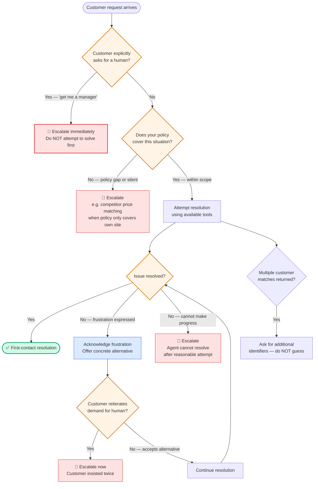

# Diagram 8 — Escalation Decision Tree

**Domain 5 · Task Statement 5.2 · Weight: 15%**

The exam tests whether you know **when** to escalate and **how** to hand off. The decision is more nuanced than "if it's hard, escalate." The wrong answer is usually a proxy metric (sentiment, self-reported confidence) that sounds reasonable but doesn't actually correlate with escalation need.

---

## The decision tree



---

## What to notice

1. **Explicit request = immediate escalation.** When a customer says "get me a manager," you escalate — you don't "try to help first." This is the number-one mistake the exam tests.

2. **Frustration ≠ request for a human.** "This is outrageous!" is an expression of emotion. "Get me a manager!" is an explicit request. The first gets acknowledgement + a resolution offer. The second gets immediate escalation.

3. **Policy gaps trigger escalation.** If the customer asks for something your policy doesn't cover (competitor price matching when you only handle own-site adjustments), escalate to a human who can make exceptions.

4. **Multiple matches = ask, don't guess.** If `get_customer` returns 3 possible matches, the agent asks for additional identifiers (phone, address, order number). Picking the "most likely" match by heuristic is a distractor answer.

---

## Structured handoff

On escalation, the agent compiles a summary for the human operator. The operator does **not** have access to the full conversation transcript.

```python
"""
Structured handoff summary passed to the human agent.
Must be self-contained — the human cannot see the chat history.
"""

handoff = {
    "customer_id": "CUST-12345",
    "customer_name": "Alice Example",
    "issue_summary": "Refund request for damaged item — customer insists on full refund",
    "order_id": "ORD-67890",
    "order_date": "2025-01-15",
    "order_amount": "$89.99",
    "root_cause": "Item arrived damaged; photos provided by customer",
    "actions_taken": [
        "Verified customer identity via get_customer",
        "Confirmed order details via lookup_order",
        "Offered standard replacement — customer declined",
        "Offered store credit — customer declined",
    ],
    "refund_amount": "$89.99",
    "recommended_action": "Approve full refund — standard damage policy applies",
    "escalation_reason": "Customer explicitly requested to speak with a manager",
}
```

---

## Invalid escalation triggers (distractor answers)

| Invalid trigger | Why it fails |
|---|---|
| **Sentiment analysis** | Customer mood does not correlate with case complexity. An angry customer with a simple return doesn't need escalation. A calm customer with a policy exception does. |
| **Self-reported confidence (1–10)** | The model can be confidently wrong. It may rate itself 9/10 on a case it's mishandling, and 3/10 on a case it could easily resolve. Calibration is poor. |
| **Automatic classifier on ticket history** | Over-engineered as a first fix. Requires labelled training data and ML infrastructure. Try explicit criteria with few-shot examples first. |
| **Complexity heuristic** | What counts as "complex"? Without explicit criteria, the agent will get this wrong in both directions (escalating simple cases, handling complex ones). |

---

## Working example: escalation criteria in system prompt

```python
system_prompt = """You are a customer support agent. You have access to:
- get_customer: verify customer identity
- lookup_order: check order details
- process_refund: issue refunds (up to $500)
- escalate_to_human: transfer to a human agent

## Escalation Rules

IMMEDIATELY escalate when:
- The customer explicitly asks to speak with a human or manager
- The customer's request falls outside documented policy
- You cannot make meaningful progress after 2 tool calls

Do NOT escalate when:
- The customer expresses frustration but hasn't asked for a human
  → Acknowledge their frustration, then offer a concrete resolution
- The case seems complex but is within your toolset
  → Attempt resolution first

## Escalation Examples

Customer: "I want to talk to someone in charge"
→ IMMEDIATELY call escalate_to_human. Do not investigate first.

Customer: "This is ridiculous! My order was damaged!"
→ Acknowledge frustration: "I understand this is frustrating."
→ Look up the order and offer a replacement or refund.
→ Only escalate if the customer then says "No, get me a manager."

Customer: "Can you match the price on CompetitorSite?"
→ Our policy covers only price adjustments on our own site.
→ This is a policy gap — escalate with context.

## Handoff Format
When escalating, compile a JSON summary with:
customer_id, issue_summary, order_id, root_cause,
actions_taken, recommended_action, escalation_reason
"""
```

---

## Common exam patterns

- **"Agent escalates simple returns but handles complex policy exceptions."** → Add explicit escalation criteria with few-shot examples. **Not** sentiment analysis. **Not** self-reported confidence.
- **"Agent resolves only 55% (target 80%)."** → Calibration problem — explicit criteria tell the agent what to handle vs escalate. The root cause is unclear decision boundaries.
- **"Customer says 'this is outrageous!'"** → Acknowledge frustration, offer resolution. **Not** immediate escalation (that's for explicit requests like "get me a manager").
- **"`get_customer` returns 3 matches."** → Ask for additional identifiers. **Not** select the most recent or most likely match.

---

## Related diagrams

- **Diagram 6** — Hooks (financial thresholds can be enforced via PreToolUse instead of relying on the agent's judgement)
- **Diagram 7** — Error taxonomy (some escalations are triggered by unrecoverable errors)
- **Diagram 14** — Context management (the handoff summary must preserve key facts extracted during the conversation)
