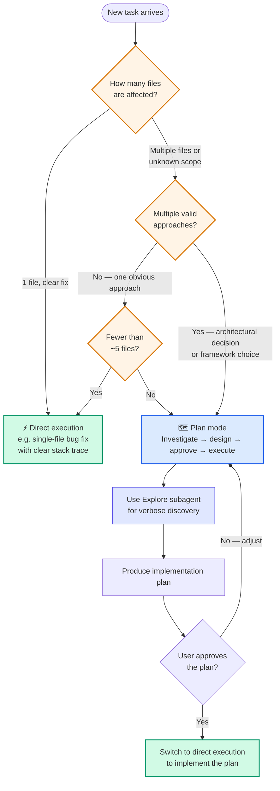

# Diagram 9 — Plan Mode vs Direct Execution

**Domain 3 · Task Statement 3.4 · Weight: 20%**

Claude Code has two modes of operation: plan mode (investigate and design before changing anything) and direct execution (make changes immediately). The exam tests whether you can match the mode to the task's scope and ambiguity.

---

## Decision tree



---

## What to notice

1. **Plan mode is for investigation.** The model reads (Grep, Glob, Read) but doesn't write. It produces a plan that the user approves. This prevents costly rework when you discover dependencies mid-implementation.

2. **The combined approach is the common pattern.** Plan mode for discovery and design → user approves → direct execution for implementation. This isn't indecisive — it's how you handle complex tasks safely.

3. **Explore subagent isolates verbose output.** During investigation, the model may read 15+ files. The Explore subagent runs this in a forked context and returns only a summary, preventing context window exhaustion.

4. **"Start direct and switch to plan if needed" is the wrong answer.** If the task description already signals complexity (microservices restructuring, 45+ file migration), starting in direct mode and hoping to notice when it gets hard is reactive — the exam calls this out explicitly.

---

## When to use plan mode

| Signal | Example | Why plan mode helps |
|---|---|---|
| Dozens of files affected | Microservices restructuring | Need to understand dependencies before touching anything |
| Multiple valid approaches | "Redux or Context API?" | Need to evaluate tradeoffs before committing |
| Architectural decisions | Service boundary design | Wrong choice is expensive to reverse |
| Unfamiliar codebase | First week on a legacy project | Must understand before changing |
| Large migration | Library swap across 45+ files | Need a migration plan, not file-by-file improvisation |

## When to use direct execution

| Signal | Example | Why direct is fine |
|---|---|---|
| Single file, clear fix | Bug fix with stack trace pointing to one function | No ambiguity — just fix it |
| One validation check | Add null check to an endpoint | Scope is obvious |
| Well-understood change | Add a column to an existing pattern | Team has done this before |
| Implementing an approved plan | Post-plan-mode execution | Investigation is done — time to act |

---

## Working example: the combined approach

```bash
# Phase 1: Plan mode — investigate the codebase
claude --plan "We need to migrate from Moment.js to date-fns.
Investigate:
1. How many files import moment?
2. Which moment APIs are used?
3. Are there any moment plugins in use?
4. What's the test coverage for date-handling code?
Produce a migration plan with priority order."

# Claude explores with Grep, Glob, Read.
# Returns: "47 files import moment. APIs used: format (32), diff (8),
# duration (4), plugin: moment-timezone (3). Test coverage: 60%.
# Recommended order: utilities first, then components, then API handlers."

# Phase 2: Direct execution — implement the approved plan
claude "Execute the migration plan from the previous session.
Start with src/utils/date-helpers.ts as planned.
Run tests after each file to catch regressions early."
```

```bash
# Using Explore subagent for verbose discovery
claude --plan "Before we restructure the payments module:
Use the Explore subagent to map all dependencies of
src/payments/ — I don't want 15 files of exploration
output in my main context."

# Explore runs in a forked context.
# Main session receives: "Payments module depends on
# AuthService, OrderModel, ExternalPaymentGateway API.
# 3 circular dependencies detected."
```

---

## Anti-patterns the exam tests

**❌ Starting direct and switching to plan when it gets hard**
```
# Task: "Restructure monolith into microservices"
# Answer D: "Begin in direct execution and switch to plan mode
#            if you encounter unexpected complexity"
# The complexity is STATED in the task — it's not a surprise.
```

**❌ Direct execution with comprehensive upfront instructions**
```
# Task: "Restructure monolith into microservices"
# Answer C: "Use direct execution with detailed instructions
#            specifying exactly how each service should be structured"
# Assumes you already know the structure without exploring.
```

**❌ Not using Explore subagent for verbose phases**
```
# Claude reads 20 files during investigation.
# All that raw content fills the main context window.
# Later questions get degraded answers due to context exhaustion.
# Fix: use Explore subagent to isolate discovery output.
```

---

## Common exam patterns

- **"Restructure a monolith into microservices."** → Plan mode. Dozens of files, multiple valid approaches, architectural decisions.
- **"Add a date validation check to one function."** → Direct execution. Single file, clear scope, no ambiguity.
- **"Migrate from library X to Y across 45+ files."** → Plan mode for investigation, then direct execution for implementation.
- **"How to prevent context exhaustion during a multi-phase investigation?"** → Explore subagent for verbose discovery phases. Also: `/compact` to compress history when context fills up.

---

## Related diagrams

- **Diagram 3** — CLAUDE.md hierarchy (provides project context that informs plan mode investigation)
- **Diagram 4** — Skills with `context: fork` (same isolation concept as the Explore subagent)
- **Diagram 10** — Task decomposition (plan mode often produces a decomposed plan)
- **Diagram 17** — Session management (plan and execute can span sessions via `--resume`)
