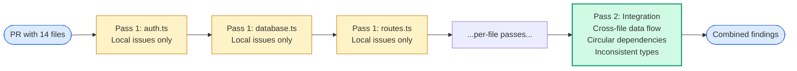
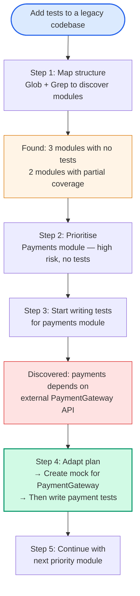

# Diagram 10 — Task Decomposition: Fixed Pipelines vs Dynamic Decomposition

**Domain 1 · Task Statement 1.6 · Weight: 27%**

Complex tasks need to be broken into smaller pieces. The exam tests whether you can pick the right decomposition strategy: fixed sequential pipelines for predictable tasks, or dynamic adaptive decomposition for open-ended investigations.

---

## Fixed pipeline (prompt chaining)



**When to use:** the task structure is predictable and repeatable. Every code review follows the same pattern: analyse each file, then check cross-file interactions.

---

## Dynamic adaptive decomposition



**When to use:** the full scope is unknown upfront. Each step depends on what the previous step discovered. The plan evolves as you learn.

---

## Side-by-side comparison

| Attribute | Fixed pipeline | Dynamic decomposition |
|---|---|---|
| Task structure | Known in advance | Emerges during execution |
| Steps | Pre-defined sequence | Generated from intermediate results |
| Adaptability | Low — follows the script | High — plan changes based on findings |
| Best for | Code review, file migration, data extraction | Legacy codebase investigation, open-ended research |
| Risk | May miss unexpected patterns | May explore unproductive paths |
| Exam keyword | "Prompt chaining" | "Adaptive investigation plan" |

---

## What to notice

1. **Multi-file review must use multi-pass, not single-pass.** A single pass over 14 files causes attention dilution — some files get deep analysis, others get superficial comments, and the model contradicts itself (flagging a pattern in one file, approving it in another).

2. **Per-file + integration pass is the standard pattern.** Each file gets focused local analysis. Then a separate pass examines cross-file interactions (data flow, type consistency, circular dependencies).

3. **Dynamic decomposition starts with mapping, not coding.** The first step is always structural discovery (Glob for files, Grep for patterns). You can't prioritise what you haven't inventoried.

4. **The exam asks you to pick the strategy, not implement both.** Look for keywords: "predictable multi-aspect review" → prompt chaining. "Open-ended investigation" or "legacy codebase" → dynamic decomposition.

---

## Working example: multi-pass code review

```python
"""
Prompt chaining for code review: per-file local analysis
plus a cross-file integration pass.
"""
import anthropic

client = anthropic.Anthropic()


def review_pr(changed_files: list[str]) -> dict:
    """Review a PR using multi-pass prompt chaining."""

    # Pass 1: Per-file local analysis
    per_file_findings = {}
    for filepath in changed_files:
        file_content = read_file(filepath)
        response = client.messages.create(
            model="claude-sonnet-4-6",
            max_tokens=2048,
            system="""You are a code reviewer. Analyse this single file for:
- Logic errors and edge cases
- Security vulnerabilities
- Missing error handling
- Naming inconsistencies

Focus ONLY on issues within THIS file. Do not comment on
cross-file dependencies — that's a separate pass.

Output JSON: [{"file": "...", "line": N, "severity": "...",
"issue": "...", "fix": "..."}]""",
            messages=[{"role": "user", "content": f"Review {filepath}:\n\n{file_content}"}],
            tools=[{
                "name": "report_findings",
                "description": "Report code review findings for this file.",
                "input_schema": {
                    "type": "object",
                    "properties": {
                        "findings": {
                            "type": "array",
                            "items": {
                                "type": "object",
                                "properties": {
                                    "line": {"type": "integer"},
                                    "severity": {
                                        "type": "string",
                                        "enum": ["critical", "high", "medium", "low"],
                                    },
                                    "issue": {"type": "string"},
                                    "fix": {"type": "string"},
                                },
                                "required": ["line", "severity", "issue", "fix"],
                            },
                        },
                    },
                    "required": ["findings"],
                },
            }],
            tool_choice={"type": "any"},
        )
        per_file_findings[filepath] = extract_tool_result(response)

    # Pass 2: Cross-file integration analysis
    summary = "\n".join(
        f"## {fp}\n{format_findings(findings)}"
        for fp, findings in per_file_findings.items()
    )

    integration_response = client.messages.create(
        model="claude-sonnet-4-6",
        max_tokens=2048,
        system="""You are a code reviewer doing an integration review.
You have per-file findings from local analysis.
Now check for CROSS-FILE issues only:
- Inconsistent types across module boundaries
- Circular dependencies
- Data flow issues (one file produces data another consumes incorrectly)
- Missing error propagation across module boundaries

Do NOT repeat per-file findings.""",
        messages=[{
            "role": "user",
            "content": f"Per-file analysis results:\n\n{summary}\n\n"
                       f"Changed files:\n{chr(10).join(changed_files)}",
        }],
    )

    return {
        "per_file": per_file_findings,
        "integration": extract_text(integration_response),
    }
```

---

## Anti-patterns the exam tests

**❌ Single pass over many files**
```
# "Review all 14 files for issues."
# Result: detailed feedback on 3 files, superficial on 8, missed bugs in 3.
# Same pattern flagged as bad in one file, approved in another.
```

**❌ Requiring developers to split PRs**
```
# "Require submissions of 3–4 files max before review runs."
# Shifts burden to developers without improving the review system.
```

**❌ Larger context window as the fix**
```
# "Switch to a higher-tier model with a larger context window."
# Larger context ≠ better attention. The model still has attention dilution.
```

**❌ Consensus voting across multiple full passes**
```
# "Run 3 independent reviews of all 14 files. Only flag issues found in ≥2 runs."
# Real bugs found intermittently get suppressed by majority vote.
```

---

## Common exam patterns

- **"14-file PR with inconsistent review quality."** → Split into per-file local passes + cross-file integration pass. **Not** larger context window. **Not** PR size limits.
- **"Add tests to a legacy codebase."** → Dynamic decomposition: map structure → prioritise → write tests → adapt when dependencies emerge.
- **"Predictable multi-aspect code review."** → Fixed pipeline (prompt chaining).
- **"Open-ended investigation task."** → Dynamic adaptive decomposition.

---

## Related diagrams

- **Diagram 2** — Hub-and-spoke (the coordinator does the decomposition)
- **Diagram 9** — Plan mode (often produces the initial decomposition)
- **Diagram 16** — Multi-pass review (the detailed pattern for code review specifically)
