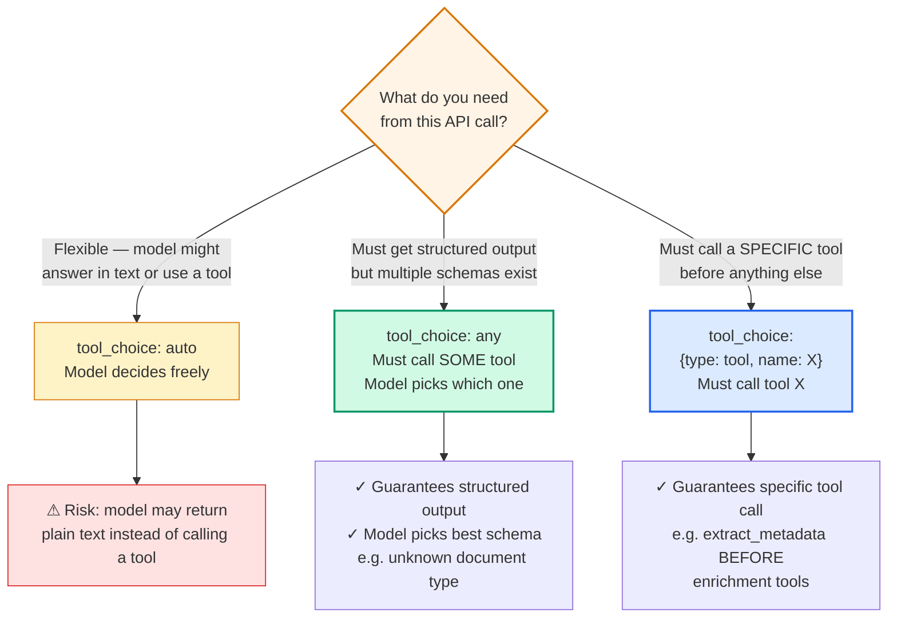
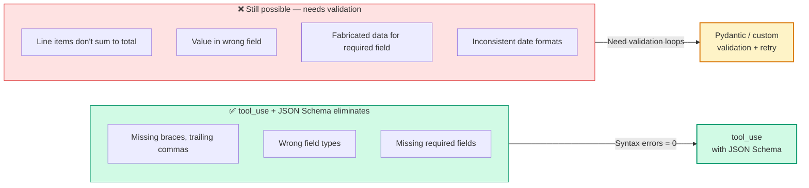

# Diagram 11 — Tool Choice and Structured Output

**Domain 4 · Task Statement 4.3 / Domain 2 · Task Statement 2.3 · Weight: 20% + 18%**

`tool_choice` controls whether and which tool the model calls. Combined with JSON schemas in tool definitions, this is the most reliable way to get structured output from Claude. The exam tests both the configuration options and schema design for extraction.

---

## `tool_choice` decision flow



---

## Schema design: syntax vs semantic guarantees



---

## What to notice

1. **`auto` can return text.** If you need guaranteed structured output, `auto` is not enough. The model may decide to answer conversationally instead of calling a tool.

2. **`any` guarantees *a* tool call, not *which* tool.** Use this when you have multiple extraction schemas and the document type is unknown — the model picks the best-fit schema.

3. **Forced selection guarantees a specific tool.** Use this to ensure a particular extraction runs first (e.g., `extract_metadata` before enrichment tools), then switch to `auto` for subsequent turns.

4. **Schema eliminates syntax errors but not semantic errors.** The JSON will be valid. The values may still be wrong. You need validation loops for semantic correctness.

5. **Nullable fields prevent hallucination.** If you mark a field as `required` but the source document doesn't contain that information, the model will fabricate a value. Use `"type": ["string", "null"]` for fields that may be absent.

---

## Working example: extraction tool with well-designed schema

```python
"""
Structured data extraction using tool_use with a JSON schema.
Demonstrates schema design principles: nullable fields, enums
with 'other' + detail, and self-correction fields.
"""
import anthropic
import json

client = anthropic.Anthropic()

# ─── Tool definition with carefully designed schema ──────

extraction_tool = {
    "name": "extract_invoice_data",
    "description": (
        "Extract structured data from an invoice document. "
        "Use null for any field whose value cannot be found in the source. "
        "Do NOT fabricate values — null is always preferred over a guess."
    ),
    "input_schema": {
        "type": "object",
        "properties": {
            "vendor_name": {
                "type": "string",
                "description": "Company name of the vendor/seller",
            },
            "invoice_number": {
                "type": ["string", "null"],
                "description": "Invoice reference number. Null if not found.",
            },
            "invoice_date": {
                "type": ["string", "null"],
                "description": "Invoice date in ISO 8601 (YYYY-MM-DD). Null if not found.",
            },
            "line_items": {
                "type": "array",
                "items": {
                    "type": "object",
                    "properties": {
                        "description": {"type": "string"},
                        "quantity": {"type": "number"},
                        "unit_price": {"type": "number"},
                        "line_total": {"type": "number"},
                    },
                    "required": ["description", "quantity", "unit_price", "line_total"],
                },
            },
            "stated_total": {
                "type": ["number", "null"],
                "description": "Total amount as stated on the invoice",
            },
            "calculated_total": {
                "type": "number",
                "description": "Sum of all line_total values — for self-correction",
            },
            "totals_match": {
                "type": "boolean",
                "description": "True if stated_total == calculated_total",
            },
            "currency": {
                "type": "string",
                "enum": ["USD", "EUR", "GBP", "JPY", "other"],
            },
            "currency_detail": {
                "type": ["string", "null"],
                "description": "If currency is 'other', specify the currency code here",
            },
            "category": {
                "type": "string",
                "enum": ["services", "products", "subscription", "unclear", "other"],
            },
            "category_detail": {
                "type": ["string", "null"],
                "description": "Details if category is 'unclear' or 'other'",
            },
            "confidence": {
                "type": "number",
                "minimum": 0,
                "maximum": 1,
                "description": "Overall extraction confidence (0–1)",
            },
        },
        "required": [
            "vendor_name", "line_items", "calculated_total",
            "totals_match", "currency", "category", "confidence",
        ],
    },
}


def extract_invoice(document_text: str) -> dict:
    """Extract structured data from an invoice using tool_use."""
    response = client.messages.create(
        model="claude-sonnet-4-6",
        max_tokens=4096,
        system=(
            "You are a data extraction specialist. Extract invoice data "
            "precisely from the provided document.\n\n"
            "Rules:\n"
            "- Dates must be ISO 8601 (YYYY-MM-DD)\n"
            "- Currency amounts must be numeric (no $ or € symbols)\n"
            "- Use null for any field not found in the source — never guess\n"
            "- Calculate calculated_total yourself from line items\n"
            "- Set totals_match to false if stated and calculated totals differ"
        ),
        tools=[extraction_tool],
        tool_choice={"type": "any"},  # MUST call a tool — guarantees structured output
        messages=[{
            "role": "user",
            "content": f"Extract data from this invoice:\n\n{document_text}",
        }],
    )

    # Extract the tool call result
    for block in response.content:
        if block.type == "tool_use":
            return block.input  # This is the structured extraction

    raise RuntimeError("No tool call in response — should not happen with tool_choice: any")


# ─── Validation and retry ────────────────────────────────

def validate_and_retry(document_text: str, extraction: dict) -> dict:
    """Validate extraction and retry with error feedback if needed."""
    errors = []

    # Semantic validation: do the numbers add up?
    calc_total = sum(item["line_total"] for item in extraction["line_items"])
    if abs(calc_total - extraction["calculated_total"]) > 0.01:
        errors.append(
            f"calculated_total ({extraction['calculated_total']}) does not match "
            f"sum of line_total values ({calc_total})"
        )

    if extraction.get("stated_total") and not extraction["totals_match"]:
        errors.append(
            f"Discrepancy: stated_total={extraction['stated_total']}, "
            f"calculated_total={extraction['calculated_total']}"
        )

    if not errors:
        return extraction  # Valid — no retry needed

    # Retry with error feedback
    retry_response = client.messages.create(
        model="claude-sonnet-4-6",
        max_tokens=4096,
        system="You are a data extraction specialist. Fix the errors in the previous extraction.",
        tools=[extraction_tool],
        tool_choice={"type": "any"},
        messages=[
            {"role": "user", "content": f"Document:\n{document_text}"},
            {"role": "assistant", "content": [
                {"type": "tool_use", "id": "retry", "name": "extract_invoice_data",
                 "input": extraction},
            ]},
            {"role": "user", "content": [
                {"type": "tool_result", "tool_use_id": "retry",
                 "content": f"Validation errors:\n" + "\n".join(f"- {e}" for e in errors)
                            + "\n\nPlease re-extract with these errors corrected.",
                 "is_error": True},
            ]},
        ],
    )

    for block in retry_response.content:
        if block.type == "tool_use":
            return block.input

    return extraction  # Return original if retry also fails
```

**Key schema design patterns in this code:**
- `invoice_number` and `invoice_date` are nullable — they may not be present on every invoice
- `stated_total` vs `calculated_total` + `totals_match` — self-correction for arithmetic consistency
- `currency` enum includes `"other"` + `currency_detail` — extensible categorisation
- `category` enum includes `"unclear"` — honest uncertainty over wrong classification
- `confidence` as a number — enables downstream routing to human review

---

## Anti-patterns the exam tests

**❌ Using `tool_choice: "auto"` when structured output is required**
```python
tool_choice={"type": "auto"}
# Model may return: "The invoice is from Acme Corp for $1,234.56"
# instead of calling the extraction tool.
```

**❌ All fields required when data may be absent**
```json
"required": ["vendor_name", "invoice_number", "invoice_date", "po_number"]
# po_number doesn't exist on this invoice → model fabricates "PO-0001"
```

**❌ Retrying when information is absent from source**
```python
# Validation: "po_number is null"
# Retry prompt: "Please extract po_number"
# Result: model halluccinates a PO number that doesn't exist.
# Fix: only retry for format/structural errors, not missing data.
```

---

## Common exam patterns

- **"Guarantee structured output when document type is unknown."** → `tool_choice: "any"` with multiple extraction schemas. Model picks the best fit.
- **"Ensure metadata extraction runs before enrichment."** → `tool_choice: {"type": "tool", "name": "extract_metadata"}` on the first call.
- **"Model fabricates values for missing fields."** → Make fields nullable (`"type": ["string", "null"]`).
- **"Extracted totals don't match line items."** → Semantic validation, not schema enforcement. Include `calculated_total` + `stated_total` + `totals_match` for self-correction.

---

## Related diagrams

- **Diagram 1** — Agentic loop (tool_use drives the loop's stop_reason)
- **Diagram 5** — MCP architecture (MCP tools use the same tool_use mechanism)
- **Diagram 12** — Batch API (batch processing uses same schemas but no multi-turn)
