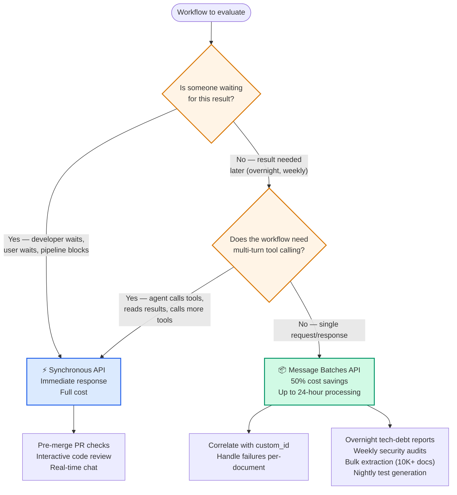

# Diagram 12 — Batch API vs Synchronous API

**Domain 4 · Task Statement 4.5 · Weight: 20%**

The Message Batches API offers 50% cost savings with up to 24-hour processing. The exam tests whether you can match each workflow to the right API based on latency tolerance and blocking requirements.

---

## Decision flow



---

## What to notice

1. **Batch has no latency SLA.** Processing can take up to 24 hours. Even if it "often" finishes faster, you cannot rely on that for blocking workflows.

2. **Batch does not support multi-turn tool calling.** One request → one response. If your workflow requires the model to call a tool, inspect the result, and decide what to do next, batch won't work.

3. **`custom_id` is essential.** It links each request to its response. On failure, you re-submit only the failed documents (identified by `custom_id`), not the entire batch.

4. **The exam always pairs one blocking and one non-blocking workflow.** The correct answer keeps sync for the blocking one and moves the non-blocking one to batch. Distractors suggest moving both to batch (wrong — blocks developers) or keeping both on sync (wrong — wastes money).

---

## Working example: batch extraction pipeline

```python
"""
Batch processing pipeline for document extraction.
Demonstrates submission, polling, failure handling, and SLA planning.
"""
import anthropic
import time
import json

client = anthropic.Anthropic()

# ─── Step 1: Build batch requests ────────────────────────

def build_batch_requests(documents: list[dict]) -> list[dict]:
    """Create batch request objects with custom_id for correlation."""
    return [
        {
            "custom_id": f"doc-{doc['id']}",  # Links request to response
            "params": {
                "model": "claude-sonnet-4-6",
                "max_tokens": 2048,
                "system": (
                    "Extract structured data from this document. "
                    "Use null for any field not found. "
                    "Return JSON with: vendor, date, total, line_items, category."
                ),
                "tools": [extraction_tool],  # Same schema as Diagram 11
                "tool_choice": {"type": "any"},
                "messages": [
                    {"role": "user", "content": f"Extract from:\n\n{doc['text']}"}
                ],
            },
        }
        for doc in documents
    ]


# ─── Step 2: Submit and poll ─────────────────────────────

def run_batch(documents: list[dict]) -> dict:
    """Submit batch, poll for completion, return results by custom_id."""
    requests = build_batch_requests(documents)

    # Submit
    batch = client.messages.batches.create(requests=requests)
    batch_id = batch.id

    # Poll (in production, use webhooks instead)
    while True:
        status = client.messages.batches.retrieve(batch_id)
        if status.processing_status == "ended":
            break
        time.sleep(60)  # Check every minute

    # Collect results
    results = {}
    failures = {}
    for result in client.messages.batches.results(batch_id):
        cid = result.custom_id
        if result.result.type == "succeeded":
            results[cid] = extract_tool_data(result.result.message)
        else:
            failures[cid] = result.result

    return {"results": results, "failures": failures}


# ─── Step 3: Handle failures ─────────────────────────────

def retry_failures(
    failures: dict,
    original_documents: dict,  # keyed by custom_id
) -> dict:
    """Re-submit only failed documents with modified strategy."""
    retry_requests = []
    for custom_id, failure in failures.items():
        doc = original_documents[custom_id]

        if "context_length" in str(failure):
            # Document was too long — chunk it
            chunks = split_into_chunks(doc["text"], max_tokens=80000)
            for i, chunk in enumerate(chunks):
                retry_requests.append({
                    "custom_id": f"{custom_id}-chunk-{i}",
                    "params": {
                        "model": "claude-sonnet-4-6",
                        "max_tokens": 2048,
                        "messages": [
                            {"role": "user", "content": f"Extract from chunk:\n\n{chunk}"}
                        ],
                        "tools": [extraction_tool],
                        "tool_choice": {"type": "any"},
                    },
                })
        else:
            # Generic retry with same params
            retry_requests.append({
                "custom_id": custom_id,
                "params": original_documents[custom_id]["params"],
            })

    if retry_requests:
        retry_batch = client.messages.batches.create(requests=retry_requests)
        # ... poll and collect as above

    return retry_requests


# ─── SLA calculation ─────────────────────────────────────

"""
SLA planning example:
- Deadline: results needed by 8:00 AM Monday
- Batch processing: up to 24 hours
- Buffer: want 6 hours for retry if first batch has failures

Timeline:
  Saturday 02:00 AM  → Submit batch
  Sunday 02:00 AM    → Worst-case batch completes (24h)
  Sunday 02:00 AM    → Identify failures, re-submit
  Monday 02:00 AM    → Worst-case retry completes (24h)
  Monday 08:00 AM    → Results ready with 6h buffer

For tighter SLAs, use smaller batch windows (e.g., 4-hour submission cadence).
"""
```

---

## Anti-patterns the exam tests

**❌ Batch for blocking workflows**
```
# "Move pre-merge PR checks to batch for 50% savings"
# Developers wait up to 24 hours to merge. Unacceptable.
```

**❌ Sync for everything "to avoid batch issues"**
```
# "Keep real-time calls for both workflows"
# Wastes 50% on overnight reports that don't need low latency.
# Distractor claims "batch result ordering issues" — custom_id solves this.
```

**❌ Batch with timeout fallback**
```
# "Use batch with fallback to sync if it takes too long"
# Over-complicated. Just match each workflow to the right API upfront.
```

**❌ Not iterating prompts before large batches**
```
# Submit 10,000 documents without testing on a sample.
# 30% fail validation → expensive re-submission.
# Fix: refine prompts on a sample set first.
```

---

## Common exam patterns

- **"Reduce cost for (1) pre-merge checks and (2) overnight tech-debt reports."** → Sync for (1), batch for (2). Always.
- **"Batch API can't support this workflow — why?"** → Multi-turn tool calling. Batch is single request/response.
- **"5 of 100 batch documents failed."** → Identify by `custom_id`, modify strategy (chunk oversized docs), re-submit only the 5.
- **"Need results within 30 hours."** → 30 − 24 = 6 hour submission window. Plan accordingly.

---

## Related diagrams

- **Diagram 11** — Tool choice and schemas (same extraction tools, different API)
- **Diagram 16** — Multi-pass review (sync API for the interactive review case)
