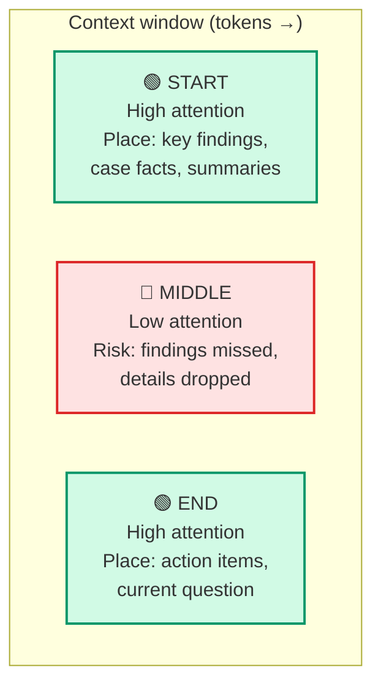
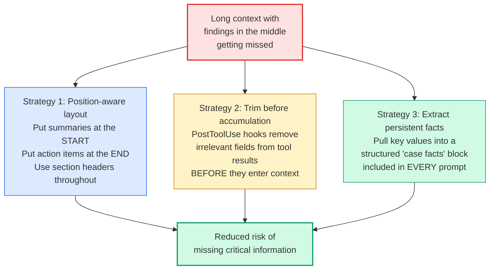

# Diagram 13 — Context Window: Lost-in-the-Middle and Mitigation

**Domain 5 · Task Statement 5.1 · Weight: 15%**

The context window has a well-documented attention bias: models reliably process the **beginning** and **end** of long inputs but can miss content in the **middle**. This diagram covers the problem and the three main mitigation strategies.

---

## The attention curve



---

## Three mitigation strategies



---

## What to notice

1. **Lost-in-the-middle is about attention quality, not context size.** A larger context window doesn't fix this — it just moves the "middle" to a bigger zone. The exam uses "switch to a larger context model" as a distractor answer.

2. **Tool results accumulate silently.** Each `lookup_order` call adds 40+ fields. After 5 calls, you have 200+ fields in context — most irrelevant. This crowds out the information the model actually needs.

3. **Progressive summarization loses precision.** When history is compressed, "$89.99 on 2025-01-15" becomes "about $90 recently." Extracting facts into a persistent block prevents this.

4. **Full conversation history is required.** Every API request must include the full message history for coherent reasoning. The challenge is keeping that history focused, not truncating it.

---

## Working example: case facts block

```python
"""
Maintaining a structured 'case facts' block across a multi-turn
customer support conversation. The block is included in every prompt,
outside the summarized history, so key values are never lost.
"""

case_facts = {
    "customer_id": None,
    "customer_name": None,
    "order_id": None,
    "order_date": None,
    "order_amount": None,
    "issue": None,
    "customer_request": None,
    "status": None,
}


def update_case_facts(tool_name: str, tool_result: dict):
    """Extract key facts from tool results into the persistent block."""
    if tool_name == "get_customer":
        case_facts["customer_id"] = tool_result.get("customer_id")
        case_facts["customer_name"] = tool_result.get("name")

    elif tool_name == "lookup_order":
        case_facts["order_id"] = tool_result.get("order_id")
        case_facts["order_date"] = tool_result.get("date")
        case_facts["order_amount"] = tool_result.get("total")


def build_system_prompt(base_prompt: str) -> str:
    """Include case facts at the TOP of every prompt."""
    facts_block = "\n".join(
        f"  {k}: {v}" for k, v in case_facts.items() if v is not None
    )
    if facts_block:
        return (
            f"=== CASE FACTS (verified — do not override from memory) ===\n"
            f"{facts_block}\n"
            f"=== END CASE FACTS ===\n\n"
            f"{base_prompt}"
        )
    return base_prompt
```

## Working example: trimming tool output with PostToolUse

```python
"""
PostToolUse hook that trims verbose tool output before
it enters the context window.
"""
from claude_agent_sdk import hook

# Only these fields matter for customer support resolution
RELEVANT_ORDER_FIELDS = {
    "order_id", "status", "total", "items",
    "return_eligible", "order_date", "shipping_address",
}

RELEVANT_CUSTOMER_FIELDS = {
    "customer_id", "name", "email", "status",
    "account_created", "total_orders",
}


@hook("PostToolUse", tool="lookup_order")
def trim_order(tool_name, tool_result):
    """40+ fields → 7 relevant fields."""
    if isinstance(tool_result, dict):
        return {k: v for k, v in tool_result.items() if k in RELEVANT_ORDER_FIELDS}
    return tool_result


@hook("PostToolUse", tool="get_customer")
def trim_customer(tool_name, tool_result):
    """Reduce customer profile to support-relevant fields."""
    if isinstance(tool_result, dict):
        return {k: v for k, v in tool_result.items() if k in RELEVANT_CUSTOMER_FIELDS}
    return tool_result
```

## Working example: position-aware input layout

```python
"""
Structuring aggregated research results with position-aware layout
to mitigate lost-in-the-middle effects.
"""

def build_synthesis_input(search_results: list, analysis_results: list) -> str:
    """Place key findings at start, details in middle with headers, action items at end."""

    # ── START: key findings summary (high-attention zone) ──
    output = "## KEY FINDINGS SUMMARY\n"
    output += "The following are the most important findings across all sources:\n"
    for finding in get_top_findings(search_results + analysis_results, n=5):
        output += f"- {finding['claim']} (Source: {finding['source']})\n"
    output += "\n"

    # ── MIDDLE: detailed results with explicit section headers ──
    output += "## DETAILED SEARCH RESULTS\n"
    for i, result in enumerate(search_results):
        output += f"### Source {i+1}: {result['source']}\n"
        output += f"{result['summary']}\n\n"

    output += "## DETAILED DOCUMENT ANALYSIS\n"
    for i, result in enumerate(analysis_results):
        output += f"### Document {i+1}: {result['document']}\n"
        output += f"{result['analysis']}\n\n"

    # ── END: action items and instructions (high-attention zone) ──
    output += "## SYNTHESIS INSTRUCTIONS\n"
    output += "Produce a report that:\n"
    output += "1. Preserves all source attributions (claim → source)\n"
    output += "2. Annotates any conflicting values with both sources\n"
    output += "3. Distinguishes well-supported findings from contested ones\n"
    output += "4. Notes coverage gaps from any unavailable sources\n"

    return output
```

---

## Anti-patterns the exam tests

**❌ Larger context window as the fix**
```
# "Switch to a model with 200K context to fit all 14 files."
# The model still has attention dilution — bigger window, same problem.
```

**❌ Progressive summarization without fact extraction**
```
# History: "Customer CUST-12345 placed order ORD-67890 for $89.99 on 2025-01-15"
# After summarization: "A customer had an issue with a recent order"
# All specifics lost. Fix: extract to case facts block first.
```

**❌ Not trimming tool results**
```
# lookup_order returns: order_id, status, total, items, return_eligible,
#   created_at, updated_at, shipping_method, tracking_number, warehouse_id,
#   internal_notes, audit_log, payment_method, ... (40+ fields)
# All of this accumulates in context. After 5 orders: 200+ useless fields.
```

---

## Common exam patterns

- **"Synthesis agent misses findings from the middle 50K tokens."** → Place key-findings summary at the start. Add section headers throughout. **Not** a larger context window.
- **"Context fills up during long investigation."** → `/compact` to compress, Explore subagent to isolate verbose output, scratchpad files (Diagram 14).
- **"Agent gives vague answers after many tool calls."** → Tool results accumulated; trim with PostToolUse hooks. Extract facts into persistent block.
- **"Upstream agents produce 155K tokens but synthesis works best under 50K."** → Modify upstream to return structured data (key facts + relevance scores) instead of verbose content.

---

## Related diagrams

- **Diagram 6** — Hooks (PostToolUse for trimming tool output)
- **Diagram 14** — Scratchpad and case-facts (the persistence mechanism)
- **Diagram 15** — Provenance (structured outputs that survive context management)
