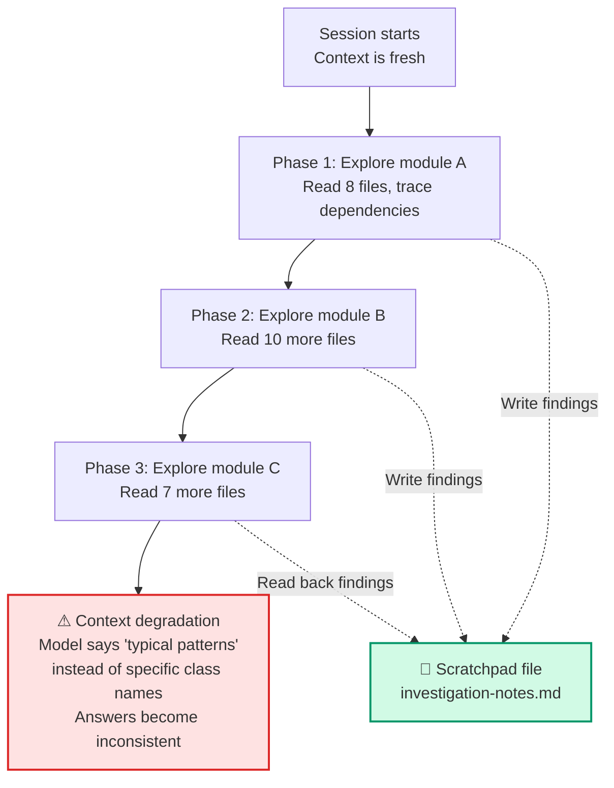
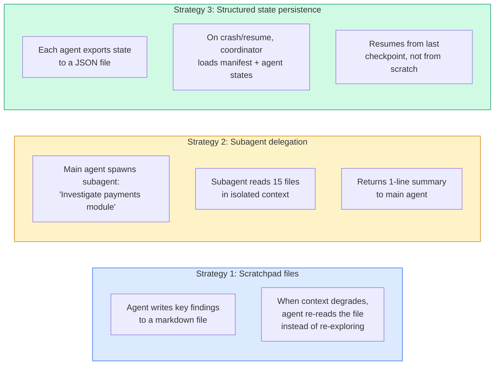

# Diagram 14 — Scratchpad Files, Subagent Delegation, and Crash Recovery

**Domain 5 · Task Statement 5.4 · Weight: 15%**

Long codebase investigations hit context degradation — the model starts referencing "typical patterns" instead of specific classes it discovered earlier. This diagram covers the three strategies for maintaining reliable state: scratchpad files, subagent delegation, and structured state persistence for crash recovery.

---

## Context degradation over time



---

## Three strategies



---

## Working example: scratchpad file

```python
"""
Agent writes key findings to a scratchpad file during exploration.
When context degrades, it reads back the scratchpad instead of
re-running all the discovery.
"""

# During exploration, the agent uses the Write tool:
SCRATCHPAD_CONTENT = """# Investigation Scratchpad — Auth Module

## Key findings
- PaymentProcessor (src/payments/processor.ts) inherits from BaseProcessor
- refund() is called from 3 places: OrderController, AdminPanel, CronJob
- External PaymentGateway API has a rate limit of 100 req/min
- Migration #47 added refund_reason (NOT NULL) — 2024-12-01
- OrderController.handleRefund() catches PaymentGatewayError but
  does NOT catch ValidationError — likely a bug

## Dependencies
- payments → auth (imports AuthService for token validation)
- payments → orders (imports OrderModel for lookup)
- payments → external PaymentGateway API (HTTP calls)

## Open questions
- [ ] Does CronJob.processRefunds() handle partial failures?
- [ ] What happens when PaymentGateway returns 429 (rate limit)?
"""

# Later, when context has degraded:
# Agent: "Let me check my scratchpad..."
# Uses Read tool on investigation-notes.md
# Gets exact class names and relationships back without re-exploring
```

## Working example: subagent delegation for isolation

```python
"""
Main agent delegates verbose exploration to a subagent.
Main context stays clean — receives only a summary.
"""

# Main agent prompt to coordinator:
coordinator_prompt = """Investigate the payments module dependencies.
I need to know:
1. What does PaymentProcessor depend on?
2. Who calls refund()?
3. Any external API dependencies?

Use a subagent to explore — I don't want 15 files of raw content
in my context. Return only a structured summary."""

# The coordinator spawns a Task:
task_prompt = """Explore src/payments/ and answer:
1. What does PaymentProcessor depend on?
2. Who calls refund()?
3. Any external API dependencies?

Use Grep and Read to trace dependencies.
Return a structured summary — NOT raw file contents."""

# Subagent explores 15 files, returns:
subagent_result = {
    "module": "src/payments/",
    "key_class": "PaymentProcessor (extends BaseProcessor)",
    "dependencies": ["AuthService", "OrderModel", "PaymentGateway API"],
    "callers_of_refund": ["OrderController", "AdminPanel", "CronJob"],
    "external_apis": [{"name": "PaymentGateway", "rate_limit": "100 req/min"}],
    "potential_issues": ["Missing ValidationError catch in handleRefund()"],
}
# Main agent gets ~10 lines instead of 15 files worth of content
```

## Working example: crash recovery with state manifests

```python
"""
Structured state persistence for crash recovery in multi-agent systems.
Each agent exports state to a known location; the coordinator loads
a manifest on resume.
"""
import json

# Each agent writes its state after completing work:

# agent-state/web-search-agent.json
web_search_state = {
    "status": "completed",
    "queries_executed": ["AI music 2024", "AI music composition tools"],
    "results_count": 12,
    "key_findings": [
        {"claim": "AI music market $3.2B", "source": "Global AI Report 2024"},
    ],
    "coverage": ["music composition", "music production"],
    "gaps": ["music distribution", "music licensing"],
}

# agent-state/doc-analysis-agent.json
doc_analysis_state = {
    "status": "in_progress",
    "documents_processed": 8,
    "documents_remaining": 3,
    "last_processed": "doc-report-2024-q3.pdf",
    "key_findings": [
        {"claim": "8% streaming content AI-generated", "source": "Industry Survey"},
    ],
}

# agent-state/manifest.json — the coordinator reads this on resume
manifest = {
    "web-search": "completed",
    "doc-analysis": "in_progress",
    "synthesis": "not_started",
    "last_updated": "2025-03-15T14:30:00Z",
}


def resume_from_manifest(manifest_path: str):
    """Resume a multi-agent workflow from the last checkpoint."""
    with open(manifest_path) as f:
        manifest = json.load(f)

    for agent_name, status in manifest.items():
        if agent_name == "last_updated":
            continue

        if status == "completed":
            # Load state and inject findings into downstream agents
            state = load_agent_state(agent_name)
            print(f"  {agent_name}: completed — {len(state.get('key_findings', []))} findings")

        elif status == "in_progress":
            # Resume from last checkpoint
            state = load_agent_state(agent_name)
            remaining = state.get("documents_remaining", "?")
            print(f"  {agent_name}: resuming — {remaining} documents left")

        elif status == "not_started":
            # Start fresh, injecting completed agents' findings
            print(f"  {agent_name}: starting with upstream findings")
```

---

## Anti-patterns the exam tests

**❌ Resuming a session with stale tool results**
```bash
claude --resume investigation-auth
# Files changed since last session — tool results are outdated.
# Better: start a new session with a structured summary.
```

**❌ No scratchpad — relying purely on context**
```
# After reading 25 files, model says "based on typical patterns..."
# instead of naming the specific classes it found.
# Fix: write key findings to scratchpad during exploration.
```

**❌ Reading all files upfront**
```
# "Read every file in src/ before starting analysis"
# Wastes context. Build understanding incrementally:
# Grep → Read → Grep → Read, writing to scratchpad as you go.
```

---

## Common exam patterns

- **"Model gives inconsistent answers after extended exploration."** → Context degradation. Use scratchpad files to persist findings. Use `/compact` to compress history.
- **"How to prevent context exhaustion during multi-phase tasks?"** → Explore subagent for verbose phases. Scratchpad for cross-session persistence.
- **"Crash recovery in a multi-agent pipeline."** → Structured state exports (manifest) that the coordinator loads on resume.
- **"Resume vs fresh start?"** → Resume when context is still valid. Fresh start with injected summary when tool results are stale.

---

## Related diagrams

- **Diagram 2** — Hub-and-spoke (subagent delegation for context isolation)
- **Diagram 9** — Plan mode (Explore subagent for investigation phases)
- **Diagram 13** — Context window (the underlying problem these strategies solve)
- **Diagram 17** — Session management (`--resume` and `fork_session`)
