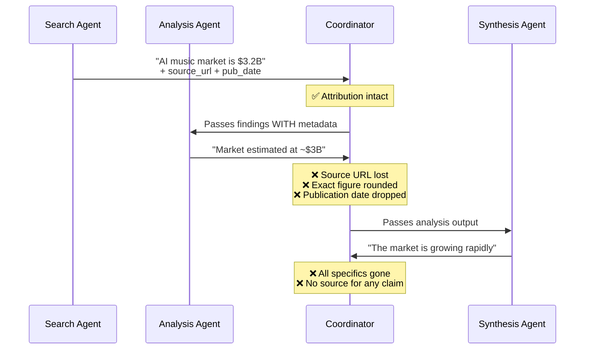
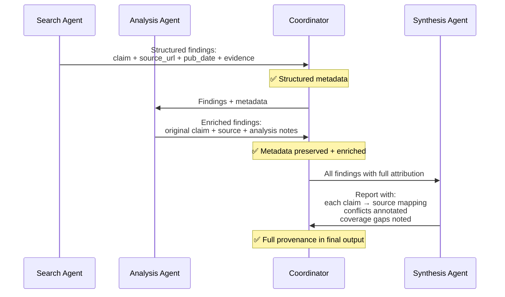

# Diagram 15 — Provenance: Claim→Source Mappings Through Synthesis

**Domain 5 · Task Statement 5.6 · Weight: 15%**

When research moves through multiple agents (search → analysis → synthesis), source attribution gets lost at each summarization step. The exam tests whether you can design structured outputs that preserve the "claim → source" link all the way to the final report.

---

## Where attribution gets lost



---

## Correct: structured claim-source mappings preserved



---

## What to notice

1. **Attribution loss happens during summarization.** Every agent that rewrites a finding has a chance to drop the source URL, round the number, or lose the date. Structured output formats prevent this.

2. **Conflicting values must be preserved with attribution.** If Source A says 12% and Source B says 8%, the report includes both with their sources — it doesn't pick one.

3. **Publication dates prevent false contradictions.** Source A (2023) says 10%, Source B (2024) says 15% — this likely represents growth, not a contradiction. Without dates, it looks like conflicting data.

4. **Different content types need different rendering.** Financial data → tables. News analysis → prose. Technical findings → structured lists. Don't force everything into one format.

---

## Working example: structured subagent output

```python
"""
Schema for subagent output that preserves provenance.
Each agent returns findings in this structure — the synthesis
agent must preserve and merge these mappings.
"""

# ─── Search agent output ─────────────────────────────────

search_output = {
    "agent": "web_search",
    "query": "AI impact on music industry 2024",
    "findings": [
        {
            "claim": "AI music market valued at $3.2 billion",
            "evidence": "The global AI music market reached $3.2B in 2024...",
            "source_url": "https://example.com/ai-music-report-2024",
            "source_name": "Global AI Music Report 2024",
            "publication_date": "2024-06-15",
            "content_type": "industry_report",
            "confidence": 0.92,
        },
        {
            "claim": "12% of streaming content is AI-generated",
            "evidence": "Our analysis shows 12% of new tracks...",
            "source_url": "https://example.com/spotify-annual-2024",
            "source_name": "Spotify Annual Report 2024",
            "publication_date": "2024-03-01",
            "content_type": "company_report",
            "confidence": 0.88,
        },
    ],
    "coverage": ["market size", "streaming share"],
    "gaps": ["licensing implications", "artist compensation"],
}


# ─── Analysis agent output (preserves + enriches) ────────

analysis_output = {
    "agent": "document_analysis",
    "findings": [
        {
            "claim": "8% of streaming content is AI-generated",
            "evidence": "Survey of 500 labels indicates 8%...",
            "source_url": "https://example.com/industry-survey-2024",
            "source_name": "Music Industry Association Survey",
            "publication_date": "2024-07-15",
            "content_type": "survey",
            "methodology": "Survey of 500 labels",
            "confidence": 0.85,
            "conflicts_with": {
                "claim": "12% of streaming content is AI-generated",
                "source": "Spotify Annual Report 2024",
                "possible_explanation": (
                    "Different methodology (automated classification vs survey) "
                    "and different time periods (Q1 2024 vs Q2 2024)"
                ),
            },
        },
    ],
}


# ─── Synthesis agent instruction ─────────────────────────

synthesis_prompt = """Synthesize these findings into a research report.

RULES:
1. Every claim in the report must have a source attribution
2. When sources CONFLICT (like the 12% vs 8% figures):
   - Include BOTH values with their sources
   - Note the methodological difference
   - Do NOT pick one over the other
3. Include publication dates for temporal context
4. Structure the report:
   - Well-established findings (multiple sources agree)
   - Contested findings (sources disagree)
   - Coverage gaps (topics not fully researched)
5. Render by content type:
   - Financial data → tables
   - News analysis → prose paragraphs
   - Technical findings → structured lists

## Search Agent Findings
{search_output}

## Document Analysis Findings
{analysis_output}
"""


# ─── Expected synthesis output structure ─────────────────

synthesis_output = {
    "title": "AI Impact on Music Industry — Research Report",
    "sections": [
        {
            "heading": "Market Size",
            "status": "well_established",
            "content": "AI music market valued at $3.2B (Global AI Music Report 2024)",
            "sources": [
                {"name": "Global AI Music Report 2024", "date": "2024-06-15"},
            ],
        },
        {
            "heading": "AI-Generated Content Share",
            "status": "contested",
            "content": (
                "Estimates range from 8% to 12% of streaming content. "
                "Spotify's automated classification (Q1 2024) yields 12%; "
                "the Music Industry Association's label survey (Q2 2024) yields 8%. "
                "Methodological difference likely accounts for the gap."
            ),
            "sources": [
                {"name": "Spotify Annual Report 2024", "date": "2024-03-01", "value": "12%"},
                {"name": "Industry Association Survey", "date": "2024-07-15", "value": "8%"},
            ],
            "conflict_annotation": (
                "Different methodology and time period — "
                "automated classification vs survey of labels"
            ),
        },
    ],
    "coverage_gaps": [
        "Licensing implications of AI-generated music",
        "Artist compensation models for AI-assisted creation",
    ],
}
```

---

## Anti-patterns the exam tests

**❌ Arbitrarily picking one conflicting value**
```
# Source A: 12%   Source B: 8%
# Report says: "AI-generated content share is 12%"
# Source B is silently dropped. Fix: include both with attribution.
```

**❌ Summarizing without source metadata**
```
# Agent output: "The market is growing rapidly"
# No URL, no source name, no date, no methodology.
# Downstream agents can't verify or attribute this claim.
```

**❌ Interpreting temporal difference as contradiction**
```
# Source A (2023): 10%    Source B (2024): 15%
# Agent: "Sources contradict — one says 10%, other says 15%"
# Reality: 5% growth over a year. Dates reveal this isn't a conflict.
```

**❌ Uniform formatting for all content types**
```
# Financial data crammed into prose: "Revenue was $3.2B, up from $2.8B, with
#   Q1 at $780M, Q2 at $820M, Q3 at $810M, and Q4 at $790M."
# This should be a table. Different content types need different rendering.
```

---

## Common exam patterns

- **"Source attribution lost after summarization."** → Require subagents to output structured claim-source mappings. Synthesis must preserve them.
- **"Two sources give different statistics."** → Include both with attribution and methodology notes. **Not** pick one. **Not** average them.
- **"How to prevent temporal misinterpretation?"** → Include publication/collection dates in structured outputs.
- **"Report should distinguish established from contested findings."** → Explicit sections: "well-established" vs "contested" vs "coverage gaps."

---

## Related diagrams

- **Diagram 2** — Hub-and-spoke (coordinator manages the information flow where provenance can be lost)
- **Diagram 7** — Error taxonomy (coverage gaps are a form of error annotation in the final output)
- **Diagram 13** — Context window (structured outputs survive context management better than prose)
