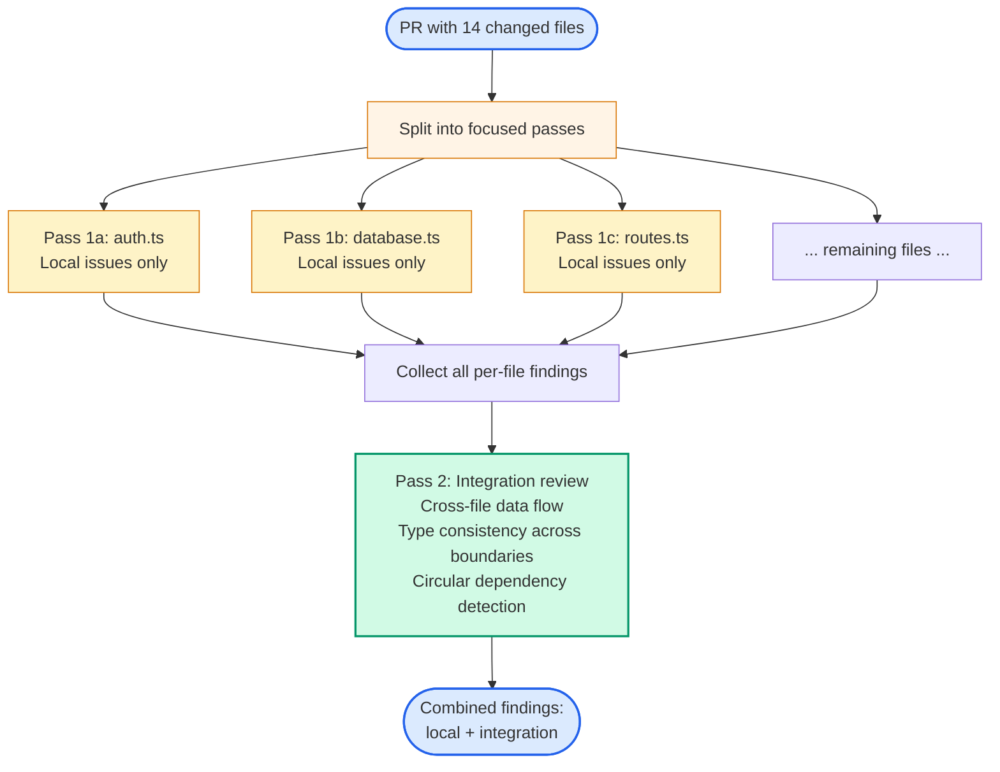
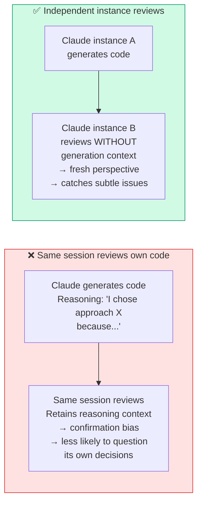

# Diagram 16 — Multi-Pass Review and Independent Review Instances

**Domain 4 · Task Statement 4.6 · Weight: 20%**

The exam tests two related insights: (1) large reviews need to be split into focused passes, and (2) the model that generated code is less effective at reviewing it. Both stem from the same principle — fresh, focused context produces better analysis than accumulated, biased context.

---

## Multi-pass review architecture



---

## Self-review limitation



---

## What to notice

1. **Per-file passes ensure consistent depth.** When 14 files are reviewed in one pass, some get thorough analysis and others get superficial comments. Per-file focus gives each file equal attention.

2. **Integration pass catches cross-file issues.** Data flow bugs, inconsistent types at module boundaries, and circular dependencies only emerge when looking at files in relationship — but this works best *after* local analysis is complete.

3. **Self-review has confirmation bias.** The model retains its reasoning context from generation. It "remembers" why it made each decision and is less likely to question those decisions. An independent instance without that context provides genuinely fresh analysis.

4. **Self-review instructions don't fix this.** Adding "be critical of your own code" to the prompt doesn't override the underlying context bias. The fix is architectural: use a separate instance.

---

## Working example: CI pipeline with independent review

```bash
#!/bin/bash
# CI pipeline: generate tests then review with independent instance

# Step 1: Generate tests (Instance A)
claude -p "Generate unit tests for the changed files in this PR.
Follow the testing standards in CLAUDE.md.
Use existing test factories from src/test/factories/.

Changed files:
$(git diff --name-only main...HEAD)" \
  --output-format json > generated_tests.json

# Step 2: Review with independent instance (Instance B)
# This instance has NO access to Instance A's reasoning.
claude -p "Review these generated tests for:
1. Correctness — do assertions match expected behavior?
2. Coverage gaps — are edge cases tested?
3. False confidence — do tests pass for the wrong reason?
4. Style — do they match our testing standards?

Generated tests:
$(cat generated_tests.json)

Source code being tested:
$(git diff main...HEAD)

Output your findings as JSON matching this schema." \
  --output-format json \
  --json-schema '{
    "type": "object",
    "properties": {
      "findings": {
        "type": "array",
        "items": {
          "type": "object",
          "properties": {
            "file": {"type": "string"},
            "line": {"type": "integer"},
            "severity": {"type": "string", "enum": ["critical","high","medium","low"]},
            "issue": {"type": "string"},
            "fix": {"type": "string"}
          },
          "required": ["file", "severity", "issue", "fix"]
        }
      }
    },
    "required": ["findings"]
  }' > review_findings.json

# Step 3: Post findings as inline PR comments
python post_review_comments.py review_findings.json
```

## Working example: few-shot prompting for review consistency

```python
"""
Few-shot examples reduce false positives and ensure
actionable, consistently formatted output.
"""

review_system_prompt = """You are a code reviewer. Analyse each file for issues.

## Output format
Each finding must include: file, line, severity, issue, and a concrete fix.

## Severity definitions with examples

CRITICAL: Runtime failure for users
  Example: NullPointerException when processing a payment
  Example: Unhandled promise rejection in API endpoint

HIGH: Security vulnerability
  Example: SQL injection via string concatenation
  Example: Missing authorization check on admin endpoint

MEDIUM: Logic error without immediate user impact
  Example: Off-by-one in pagination
  Example: Wrong sort direction in dashboard

LOW: Code quality / maintainability
  Example: Duplicated validation logic across handlers
  Example: Magic number instead of named constant

## What to flag vs ignore

FLAG:
- Bugs that affect runtime behavior
- Security vulnerabilities
- Missing error handling for failure cases

IGNORE (do not report):
- Minor style preferences (bracket placement, trailing commas)
- Patterns that are local project conventions
- Missing comments (separate category, not this review)

## Few-shot examples

Example finding (good — actionable):
{
  "file": "src/api/orders.ts",
  "line": 42,
  "severity": "high",
  "issue": "SQL injection: order_id is concatenated into query string without parameterization",
  "fix": "Use parameterized query: db.query('SELECT * FROM orders WHERE id = $1', [orderId])"
}

Example finding (bad — vague, do not produce this):
{
  "file": "src/api/orders.ts",
  "line": 42,
  "severity": "medium",
  "issue": "potential security concern in database query",
  "fix": "review the query for best practices"
}
"""
```

---

## Handling re-reviews after new commits

```python
"""
When re-running a review after the developer pushes new commits,
include prior findings so Claude reports only NEW or UNRESOLVED issues.
"""

re_review_prompt = """Review the latest changes to this PR.

## Prior review findings (from previous commit)
{previous_findings_json}

## Instructions
- Report ONLY issues that are:
  - NEW (not in the prior review)
  - STILL PRESENT (flagged before and not fixed)
- Do NOT re-report issues that have been fixed
- Do NOT repeat findings word-for-word — reference by file:line if still present

## Changed files since last review
{diff_since_last_review}
"""
```

---

## Anti-patterns the exam tests

**❌ Single pass over 14+ files**
```
# Inconsistent depth: 3 files get detailed feedback, 8 get shallow comments.
# Contradictory: same pattern flagged in one file, approved in another.
# Bugs missed due to attention dilution.
```

**❌ Self-review by the same instance**
```
# "Add instructions telling Claude to be critical of its own output."
# The model retains its reasoning — it's less likely to challenge decisions
# it already justified to itself.
```

**❌ Consensus voting across full passes**
```
# "Run 3 full reviews, only flag issues found in ≥2."
# Real bugs found intermittently get suppressed by majority vote.
```

**❌ Re-review without prior findings context**
```
# New commits → re-run full review → duplicate comments.
# Include prior findings and instruct: "report only new/unresolved issues."
```

---

## Common exam patterns

- **"14-file PR with inconsistent review quality and contradictory feedback."** → Split into per-file + integration passes. **Not** larger model. **Not** PR size limits.
- **"Non-obvious issues only caught by human reviewers."** → Independent review instance without the generator's reasoning context.
- **"Review produces vague, unactionable feedback."** → Few-shot examples showing exact format (file, line, severity, issue, fix). **Not** more detailed instructions alone.
- **"Duplicate comments on re-review after new commits."** → Include prior findings in context; instruct to report only new/unresolved issues.

---

## Related diagrams

- **Diagram 10** — Task decomposition (multi-pass review is a specific case of prompt chaining)
- **Diagram 12** — Batch vs sync (sync for interactive review; this is the detailed review pattern)
- **Diagram 13** — Context window (per-file passes avoid attention dilution from long context)
