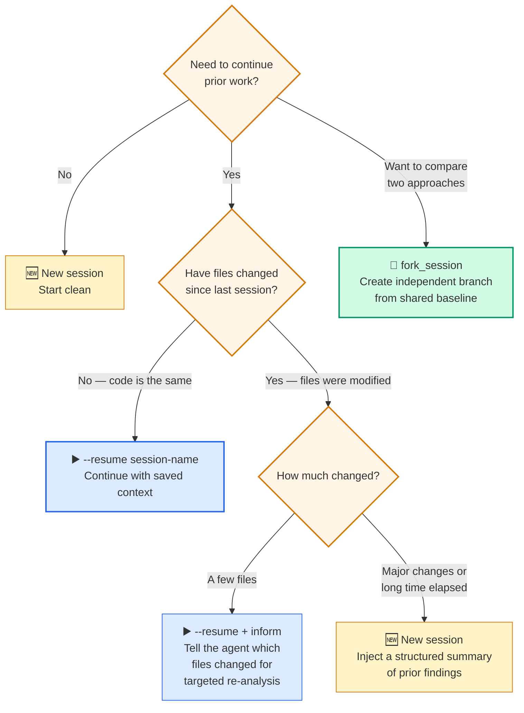
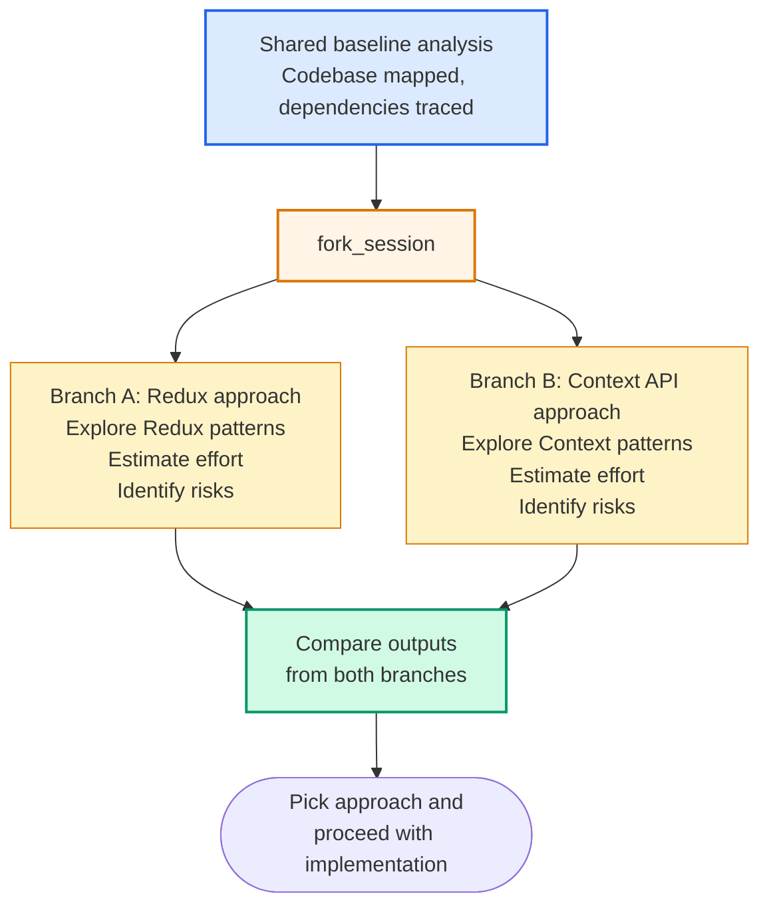

# Diagram 17 — Session Management: Resume, Fork, and Fresh Start

**Domain 1 · Task Statement 1.7 · Weight: 27%**

Claude Code sessions can be resumed, forked, or started fresh. The exam tests whether you know when each is appropriate — the trade-off is between preserving valuable context and avoiding stale or degraded state.

---

## Decision flow



---

## `fork_session` — comparing approaches



Both branches inherit all context up to the fork point. After the fork, they diverge independently — changes in Branch A don't affect Branch B.

---

## What to notice

1. **`--resume` continues a named session.** The full conversation history (including tool results) is restored. This is efficient when prior context is still valid — no need to re-explore.

2. **Stale tool results are the main risk of resuming.** If files were modified since the last session, tool results (Read, Grep) reflect the old state. The model may reason about code that no longer exists.

3. **Informing a resumed session about changes is lightweight.** Instead of full re-exploration, tell the agent "files X and Y changed — re-analyse those specifically."

4. **A fresh session with a summary is more reliable than resuming with stale state.** Write a short summary: "We found that PaymentProcessor depends on AuthService and OrderModel. refund() is called from 3 places. Next step: investigate error handling in OrderController." Then start a new session with this as the initial context.

5. **`fork_session` is for divergent exploration from a shared baseline.** It's not about error recovery — it's about comparing two valid approaches without re-doing the shared investigation.

---

## Working example: session workflows

```bash
# ─── Named session: start and resume ─────────────────────

# Start a named investigation session
claude --session-name auth-investigation \
  "Investigate the authentication flow in src/auth/.
   Map dependencies and identify potential security issues."

# ... later, continue the same session ...
claude --resume auth-investigation \
  "Now focus on the token refresh mechanism we found earlier.
   What happens when the refresh token expires mid-request?"


# ─── Resume with change notification ─────────────────────

# Developer pushed changes to two files since your last session
claude --resume auth-investigation \
  "Since our last session, two files changed:
   - src/auth/token-service.ts (added retry logic)
   - src/auth/middleware.ts (fixed null check)
   Re-analyse these files for our investigation.
   Everything else we found before is still valid."


# ─── Fresh start with injected summary ───────────────────

# Major refactoring happened — too much changed to resume
claude "Continue investigating the auth module.
Here's what we found in the previous session:

## Prior findings
- TokenService handles refresh via /api/auth/refresh
- RefreshToken model in src/models/refresh-token.ts
- Token rotation is implemented but has a race condition
  when two requests refresh simultaneously
- Dependencies: AuthService → TokenService → RedisCache

## What changed since last session
- src/auth/token-service.ts was refactored to use async/await
- A new file src/auth/token-rotation-lock.ts was added

## Next steps
- Verify the race condition fix in the new token-rotation-lock.ts
- Check if the Redis cache invalidation is correct"


# ─── Fork for comparing approaches ───────────────────────

# After mapping the codebase, explore two migration strategies
claude --session-name migration-base \
  "Map all dependencies of the legacy date handling code.
   Find every import of moment.js across the codebase."

# Fork to try two approaches
# Branch A: date-fns
claude --fork migration-base --session-name migration-datefns \
  "Based on our analysis, plan a migration to date-fns.
   Estimate effort and identify high-risk areas."

# Branch B: Temporal API
claude --fork migration-base --session-name migration-temporal \
  "Based on our analysis, plan a migration to the Temporal API.
   Estimate effort and identify high-risk areas."

# Compare outputs from both branches to make a decision
```

---

## When to use each

| Situation | Approach | Why |
|---|---|---|
| Quick break, no code changes | `--resume` | Context is still fresh and valid |
| A few files changed | `--resume` + inform | Targeted re-analysis is cheaper than full re-exploration |
| Major refactoring, days elapsed | Fresh session + summary | Stale tool results would mislead the model |
| Compare two architectures | `fork_session` | Parallel exploration from shared baseline |
| Context degradation (/compact didn't help enough) | Fresh session + scratchpad | Start clean, load key findings from scratchpad file |

---

## Anti-patterns the exam tests

**❌ Always resuming regardless of staleness**
```bash
# Last session: 3 days ago. 15 files changed since then.
claude --resume old-investigation
# Model reasons about code that no longer exists.
```

**❌ Starting fresh without preserving findings**
```bash
# "Let's start over from scratch"
# Re-doing 2 hours of exploration when a 10-line summary would suffice.
```

**❌ Using fork_session for error recovery**
```
# fork_session is for comparing approaches, not recovering from crashes.
# For crash recovery: structured state persistence (Diagram 14).
```

---

## Common exam patterns

- **"How to continue an investigation across work sessions?"** → `--resume <session-name>` for named sessions, as long as code hasn't changed significantly.
- **"Files changed since the last session."** → If minor: resume + inform. If major: fresh start with structured summary.
- **"Compare two testing strategies from the same codebase analysis."** → `fork_session` to create parallel branches.
- **"Why is a fresh start with summary better than resuming?"** → Stale tool results can mislead reasoning. A summary provides correct current state.

---

## Related diagrams

- **Diagram 1** — Agentic loop (the loop runs within each session)
- **Diagram 9** — Plan mode (plan mode investigation often spans sessions)
- **Diagram 14** — Scratchpad and crash recovery (persisting state across session boundaries)
